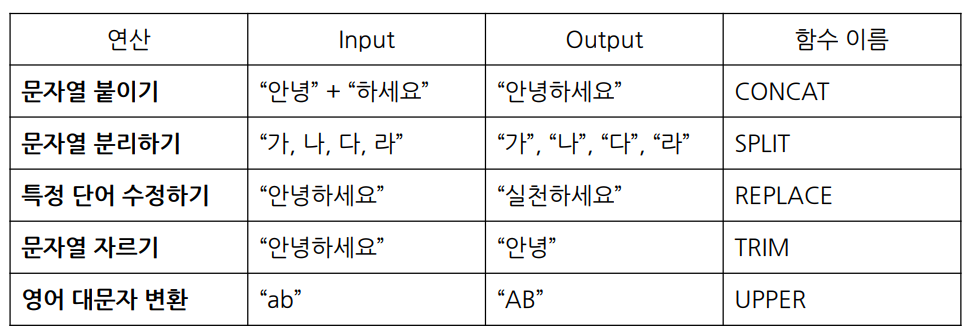
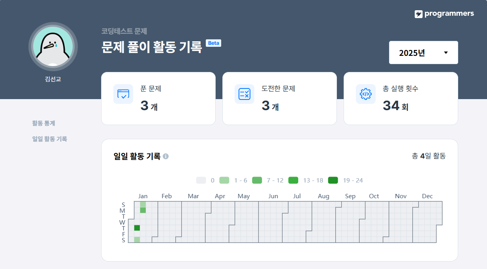
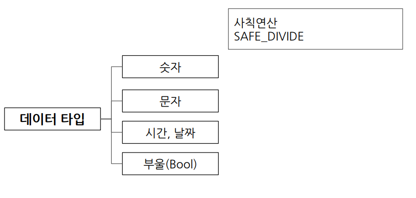
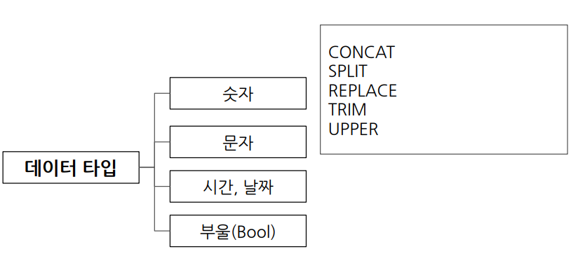
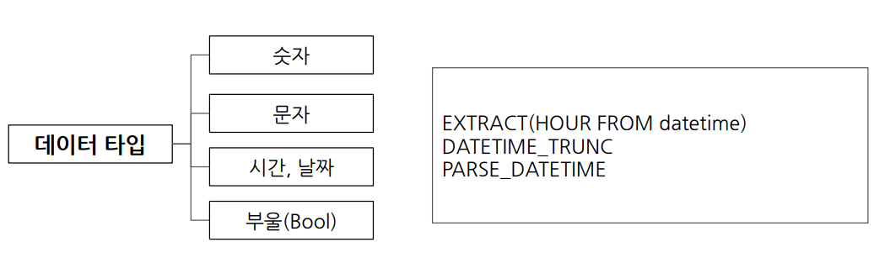
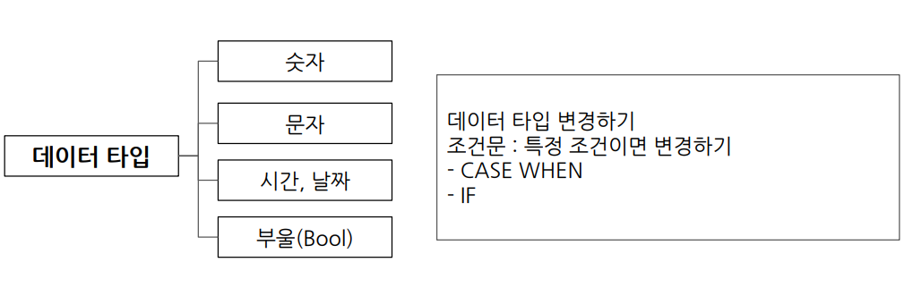

> ## 1. 잡은 물고기 중 가장 큰 물고기의 길이 구하기 (sum, min, max)
---

### 문제 링크
https://school.programmers.co.kr/learn/courses/30/lessons/298515

---

### 문제 설명

```
낚시앱에서 사용하는 FISH_INFO 테이블은 잡은 물고기들의 정보를 담고 있음 

FISH_INFO 테이블의 구조는 ID, FISH_TYPE, LENGTH, TIME으로로 각각 잡은 물고기의 ID, 물고기의 종류(숫자), 잡은 물고기의 길이(cm), 물고기를 잡은 날짜를 나타냄

단, 잡은 물고기의 길이가 10cm 이하일 경우에는 LENGTH가 NULL이며, LENGTH에 NULL만 있는 경우는 없음
```


### 문제

```
FISH_INFO 테이블에서 잡은 물고기 중 가장 큰 물고기의 길이에 'cm' 를 붙여 출력

이 때 컬럼명은 'MAX_LENGTH' 로 지정
```

### 풀이 1

```
SELECT
    CONCAT(MAX(LENGTH), 'cm') AS MAX_LENGTH
FROM FISH_INFO
```

### 풀이 2

```
SELECT
    CONCAT(LENGTH, 'cm') AS MAX_LENGTH
FROM FISH_INFO
ORDER BY
    1 DESC
LIMIT 1
```

### 중요 Point!


```
CONCAT("안녕", "하세요")
SPLIT("가, 나, 다, 라", ",")
REPLACE("안녕하세요", "안녕", "실천")
TRIM("안녕하세요", "하세요")
UPPER("ab")
```

> ## 2. 잡은 물고기의 평균 길이 구하기 (IS NULL)
---

### 문제 링크
https://school.programmers.co.kr/learn/courses/30/lessons/293259

---

### 문제 설명

```
낚시앱에서 사용하는 FISH_INFO 테이블은 잡은 물고기들의 정보를 담고 있음 

FISH_INFO 테이블의 구조는 ID, FISH_TYPE, LENGTH, TIME으로로 각각 잡은 물고기의 ID, 물고기의 종류(숫자), 잡은 물고기의 길이(cm), 물고기를 잡은 날짜를 나타냄

단, 잡은 물고기의 길이가 10cm 이하일 경우에는 LENGTH가 NULL이며, LENGTH에 NULL만 있는 경우는 없음
```

### 문제

```
잡은 물고기의 평균 길이를 출력하는 SQL문을 작성

평균 길이를 나타내는 컬럼 명은 AVERAGE_LENGTH로 지정

평균 길이는 소수점 3째자리에서 반올림하며
10cm 이하의 물고기들은 10cm로 취급하여 평균 길이를 구해야 함
```

### 풀이 1

```
SELECT
    ROUND(AVG(CASE
        WHEN LENGTH IS NULL THEN 10
        ELSE LENGTH
    END), 2) AS AVERAGE_LENGTH
FROM FISH_INFO
```
### 풀이 2

```
SELECT
    ROUND(AVG(IF(LENGTH IS NULL, 10, LENGTH)), 2) AS AVERAGE_LENGTH
FROM FISH_INFO
```

### 중요 Point!

```
1. CASE WEHN
SELECT
    CASE
        WHEN조건1 THEN조건1이 참일 경우 결과
        WHEN조건2 THEN조건2가 참일 경우 결과
        ELSE그외 조건일 경우 결과
    END AS 새로운_컬럼_이름

2. IF
IF(조건문, True일때의값, False일때의값) AS 새로운_컬럼_이름
```

> ## 3. 특정 옵션이 포함된 자동차 리스트 구하기 (String, Date)
---

### 문제 링크
https://school.programmers.co.kr/learn/courses/30/lessons/157343

---

### 문제 설명

```
어느 자동차 대여 회사에서 대여중인 자동차들의 정보를 담은 CAR_RENTAL_COMPANY_CAR 테이블

CAR_RENTAL_COMPANY_CAR 테이블은 아래와 같은 구조로 되어있으며, CAR_ID, CAR_TYPE, DAILY_FEE, OPTIONS는 각각 자동차 ID, 자동차 종류, 일일 대여 요금(원), 자동차 옵션 리스트를 나타냄

자동차 종류는 '세단', 'SUV', '승합차', '트럭', '리무진' 이 있음
자동차 옵션 리스트는 콤마(',')로 구분된 키워드 리스트(옵션 리스트 값 예시: '열선시트', '스마트키', '주차감지센서')로 되어있으며, 키워드 종류는 '주차감지센서', '스마트키', '네비게이션', '통풍시트', '열선시트', '후방카메라', '가죽시트' 가 있음
```


### 문제

```
CAR_RENTAL_COMPANY_CAR 테이블에서 '네비게이션' 옵션이 포함된 자동차 리스트를 출력하는 SQL문을 작성

결과는 자동차 ID를 기준으로 내림차순 정렬.
```

### 풀이

```
SELECT
    *
FROM CAR_RENTAL_COMPANY_CAR
WHERE
    OPTIONS LIKE '%네비게이션%'
ORDER BY
    1 DESC
```

### 중요 Point!

```
LIKE '네%' : '네'로 시작하는 모든 문자열 
LIKE '%네%' : '네'가 포함된 모든 문자열
LIKE '%네' : '네'로 끝나는 모든 문자열
LIKE '%네%비%' : '네'가 포함되고, 그 뒤에 '비'도 포함된 문자열열
```

---

### 문제 풀이 기록



---

### 기타 교재 내용




