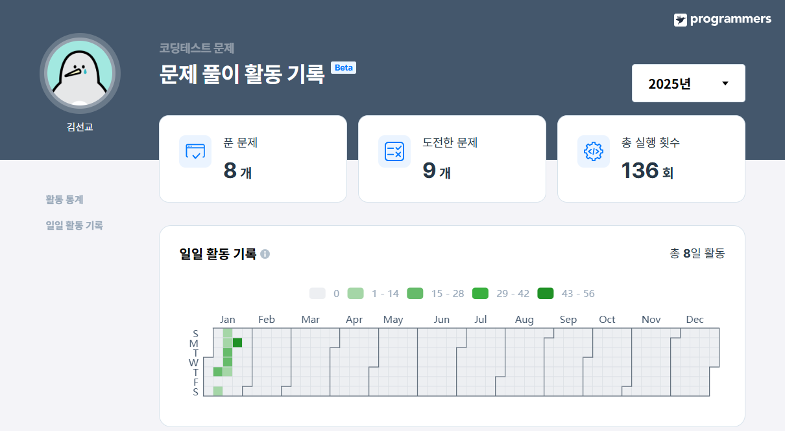

> **1. 과일로 만든 아이스크림 고르기**  
함수 : SELECT

### 문제 링크
https://school.programmers.co.kr/learn/courses/30/lessons/133025

---

### 문제 설명

다음은 아이스크림 가게의 상반기 주문 정보를 담은 `FIRST_HALF` 테이블과 아이스크림 성분에 대한 정보를 담은 `ICECREAM_INFO` 테이블입니다. `FIRST_HALF` 테이블 구조는 다음과 같으며, `SHIPMENT_ID`, `FLAVOR`, `TOTAL_ORDER` 는 각각 아이스크림 공장에서 아이스크림 가게까지의 출하 번호, 아이스크림 맛, 상반기 아이스크림 총주문량을 나타냅니다. `FIRST_HALF` 테이블의 기본 키는 `FLAVOR`입니다.

|NAME|Type|Nullable|
|-|-|-|
|SHIPMENT_ID|INT(N)|FALSE|
|FLAVOR|VARCHAR(N)|FALSE|
|TOTAL_ORDER|INT(N)|FALSE|

`ICECREAM_INFO` 테이블 구조는 다음과 같으며, `FLAVOR`, `INGREDITENT_TYPE` 은 각각 아이스크림 맛, 아이스크림의 성분 타입을 나타냅니다. `INGREDIENT_TYPE`에는 아이스크림의 주 성분이 설탕이면 `sugar_based`라고 입력되고, 아이스크림의 주 성분이 과일이면 `fruit_based`라고 입력됩니다. `ICECREAM_INFO`의 기본 키는 `FLAVOR`입니다. `ICECREAM_INFO`테이블의 `FLAVOR`는 `FIRST_HALF` 테이블의 `FLAVOR`의 외래 키입니다.

|NAME|Type|Nullable|
|-|-|-|
|FLAVOR|VARCHAR(N)|FALSE|
|INGREDIENT_TYPE|VARCHAR(N)|FALSE|

---

### 문제

상반기 아이스크림 총주문량이 3,000보다 높으면서 아이스크림의 주 성분이 과일인 아이스크림의 맛을 총주문량이 큰 순서대로 조회하는 SQL 문을 작성해주세요.

### 풀이

```SQL
SELECT
    FH.FLAVOR
FROM FIRST_HALF AS FH
LEFT JOIN ICECREAM_INFO AS IC
ON FH.FLAVOR = IC.FLAVOR
WHERE 
    TOTAL_ORDER > 3000
    AND INGREDIENT_TYPE = 'fruit_based'
ORDER BY
    TOTAL_ORDER DESC
```

### 풀이 과정

1. `ICECREAM_INFO` 테이블에는 주성분 관련 컬럼이 없으므로 `ICECREAM_INFO` 테이블과 JOIN 진행

```SQL
SELECT

FROM FIRST_HALF AS FH
LEFT JOIN ICECREAM_INFO AS IC
ON FH.FLAVOR = IC.FLAVOR
```

2. 총주문량이 3,000보다 높고 주 성분이 과일인 WHERE 조건 추가

```SQL
SELECT

FROM FIRST_HALF AS FH
LEFT JOIN ICECREAM_INFO AS IC
ON FH.FLAVOR = IC.FLAVOR
WHERE 
    TOTAL_ORDER > 3000
    AND INGREDIENT_TYPE = 'fruit_based'
```

3. 마지막으로 필요한 컬럼 선택 및 내림차순 정렬 수행

```SQL
SELECT
    FH.FLAVOR
FROM FIRST_HALF AS FH
LEFT JOIN ICECREAM_INFO AS IC
ON FH.FLAVOR = IC.FLAVOR
WHERE 
    TOTAL_ORDER > 3000
    AND INGREDIENT_TYPE = 'fruit_based'
ORDER BY
    TOTAL_ORDER DESC
```

### 실행 결과

|FLAVOR|
|-|
|strawberry|

---

> **2. 자동차 종류 별 특정 옵션이 포함된 자동차 수 구하기**  
함수 : GROUP BY

### 문제 링크
https://school.programmers.co.kr/learn/courses/30/lessons/151137

---

### 문제 설명

다음은 어느 자동차 대여 회사에서 대여중인 자동차들의 정보를 담은 `CAR_RENTAL_COMPANY_CAR` 테이블입니다. `CAR_RENTAL_COMPANY_CAR` 테이블은 아래와 같은 구조로 되어있으며, `CAR_ID`, `CAR_TYPE`, `DAILY_FEE`, `OPTIONS` 는 각각 자동차 ID, 자동차 종류, 일일 대여 요금(원), 자동차 옵션 리스트를 나타냅니다.

|Column name|Type|Nullable|
|-|-|-|
|CAR_ID|INTEGER|FALSE|
|CAR_TYPE|VARCHAR(255)|FALSE|
|DAILY_FEE|INTEGER|FALSE|
|OPTIONS|VARCHAR(255)|FALSE|

자동차 종류는 '세단', 'SUV', '승합차', '트럭', '리무진' 이 있습니다. 자동차 옵션 리스트는 콤마(',')로 구분된 키워드 리스트(옵션 리스트 값 예시: '열선시트', '스마트키', '주차감지센서')로 되어있으며, 키워드 종류는 '주차감지센서', '스마트키', '네비게이션', '통풍시트', '열선시트', '후방카메라', '가죽시트' 가 있습니다.

---

### 문제

`CAR_RENTAL_COMPANY_CAR` 테이블에서 '통풍시트', '열선시트', '가죽시트' 중 하나 이상의 옵션이 포함된 자동차가 자동차 종류 별로 몇 대인지 출력하는 SQL문을 작성해주세요. 이때 자동차 수에 대한 컬럼명은 CARS로 지정하고, 결과는 자동차 종류를 기준으로 오름차순 정렬해주세요.

### 풀이

```SQL
SELECT
    CAR_TYPE,
    COUNT(*) AS CARS
FROM CAR_RENTAL_COMPANY_CAR
WHERE 
    OPTIONS LIKE '%통풍시트%' 
    OR OPTIONS LIKE '%열선시트%' 
    OR OPTIONS LIKE '%가죽시트%'
GROUP BY
    CAR_TYPE
ORDER BY
    1 ASC
```

### 풀이 과정

1. '통풍시트', '열선시트', '가죽시트' 중 하나 이상의 옵션이 포함하는 조건을 추가

```SQL
SELECT

FROM CAR_RENTAL_COMPANY_CAR
WHERE 
    OPTIONS LIKE '%통풍시트%' 
    OR OPTIONS LIKE '%열선시트%' 
    OR OPTIONS LIKE '%가죽시트%'
```
2. 필요한 컬럼 선택 및 자동차 수를 계산하기 위한 COUNT 함수 추가

```SQL
SELECT
    CAR_TYPE,
    COUNT(*) AS CARS
FROM CAR_RENTAL_COMPANY_CAR
WHERE 
    OPTIONS LIKE '%통풍시트%' 
    OR OPTIONS LIKE '%열선시트%' 
    OR OPTIONS LIKE '%가죽시트%'
```

3. 마지막으로 GROUP BY + 오름차순 정렬 수행

```SQL
SELECT
    CAR_TYPE,
    COUNT(*) AS CARS
FROM CAR_RENTAL_COMPANY_CAR
WHERE 
    OPTIONS LIKE '%통풍시트%' 
    OR OPTIONS LIKE '%열선시트%' 
    OR OPTIONS LIKE '%가죽시트%'
GROUP BY
    CAR_TYPE
ORDER BY
    1 ASC
```

### 실행 결과

|CAR_TYPE|CARS|
|-|-|
|SUV|6|
|리무진|2|
|세단|6|
|승합차|3|
|트럭|3|

---

> **3. 가장 큰 물고기 10마리 구하기**  
함수 : SELECT

### 문제 링크
https://school.programmers.co.kr/learn/courses/30/lessons/298517

---

### 문제 설명

낚시앱에서 사용하는 `FISH_INFO` 테이블은 잡은 물고기들의 정보를 담고 있습니다. `FISH_INFO` 테이블의 구조는 다음과 같으며 `ID`, `FISH_TYPE`, `LENGTH`, `TIME`은 각각 잡은 물고기의 ID, 물고기의 종류(숫자), 잡은 물고기의 길이(cm), 물고기를 잡은 날짜를 나타냅니다.

|Column name|Type|Nullable|
|-|-|-|
|ID|INTEGER|FALSE|
|FISH_TYPE|INTEGER|FALSE|
|LENGTH|FLOAT|TRUE|
|TIME|DATE|FALSE|

단, 잡은 물고기의 길이가 10cm 이하일 경우에는 `LENGTH` 가 NULL 이며, `LENGTH` 에 NULL 만 있는 경우는 없습니다.

---

### 문제

`FISH_INFO` 테이블에서 가장 큰 물고기 10마리의 ID와 길이를 출력하는 SQL 문을 작성해주세요. 결과는 길이를 기준으로 내림차순 정렬하고, 길이가 같다면 물고기의 ID에 대해 오름차순 정렬해주세요. 단, 가장 큰 물고기 10마리 중 길이가 10cm 이하인 경우는 없습니다.

ID 컬럼명은 `ID`, 길이 컬럼명은 `LENGTH`로 해주세요.

### 풀이

```SQL
SELECT
    ID,
    LENGTH
FROM FISH_INFO 
ORDER BY
    2 DESC,
    1 ASC
LIMIT 10
```

### 풀이 과정

1. 10마리로 제한하는 LIMIT 함수 추가, 필요한 컬럼 선택 및 내림차순, 오름차순 추가

```SQL
SELECT
    ID,
    LENGTH
FROM FISH_INFO 
ORDER BY
    2 DESC,
    1 ASC
LIMIT 10
```


### 실행 결과

|ID|LENGTH|
|-|-|
|8|73|
|9|73|
|6|60|
|7|55|
|1|50|
|2|40|
|0|30|
|10|22|
|3|20|
|11|17|

---

> **4. 조건에 부합하는 중고거래 상태 조회하기**  
함수 : String, Date

### 문제 링크
https://school.programmers.co.kr/learn/courses/30/lessons/164672

---

### 문제 설명

다음은 중고거래 게시판 정보를 담은 `USED_GOODS_BOARD` 테이블입니다. `USED_GOODS_BOARD` 테이블은 다음과 같으며 `BOARD_ID`, `WRITER_ID`, `TITLE`, `CONTENTS`, `PRICE`, `CREATED_DATE`, `STATUS`, `VIEWS`은 게시글 ID, 작성자 ID, 게시글 제목, 게시글 내용, 가격, 작성일, 거래상태, 조회수를 의미합니다.

|Column name|Type|Nullable|
|-|-|-|
|BOARD_ID|VARCHAR(5)|FALSE|
|WRITER_ID|VARCHAR(50)|FALSE|
|TITLE|VARCHAR(100)|FALSE|
|CONTENTS|VARCHAR(1000)|FALSE|
|PRICE|NUMBER|FALSE|
|CREATED_DATE|DATE|FALSE|
|STATUS|VARCHAR(10)|FALSE|
|VIEWS|NUMBER|FALSE|

---

### 문제

`USED_GOODS_BOARD` 테이블에서 2022년 10월 5일에 등록된 중고거래 게시물의 게시글 ID, 작성자 ID, 게시글 제목, 가격, 거래상태를 조회하는 SQL문을 작성해주세요. 거래상태가 SALE 이면 판매중, RESERVED이면 예약중, DONE이면 거래완료 분류하여 출력해주시고, 결과는 게시글 ID를 기준으로 내림차순 정렬해주세요.

### 풀이

```SQL
SELECT
    BOARD_ID,
    WRITER_ID,
    TITLE,
    PRICE,
    (CASE
        WHEN STATUS = 'SALE' THEN '판매중'
        WHEN STATUS = 'RESERVED' THEN '예약중'
        ELSE '거래완료'
     END) AS STATUS
FROM USED_GOODS_BOARD
WHERE 
    CREATED_DATE = '2022-10-05'
ORDER BY
    1 DESC
```

### 풀이 과정

1. 작성일이 2022년 10월 5일인 WHERE 조건 추가

```SQL
SELECT

FROM USED_GOODS_BOARD
WHERE 
    CREATED_DATE = '2022-10-05'
```

2. 필요한 컬럼 선택, 거래현황을 조건에 맞게 변경할 수 있도록 CASE WHEN 함수 사용 및 내림차순 수행

```SQL
SELECT
    BOARD_ID,
    WRITER_ID,
    TITLE,
    PRICE,
    (CASE
        WHEN STATUS = 'SALE' THEN '판매중'
        WHEN STATUS = 'RESERVED' THEN '예약중'
        ELSE '거래완료'
     END) AS STATUS
FROM USED_GOODS_BOARD
WHERE 
    CREATED_DATE = '2022-10-05'
ORDER BY
    1 DESC
```

### 실행 결과

|BOARD_ID|WRITER_ID|TITLE|PRICE|STATUS|
|-|-|-|-|-|
|B0013|kwag98|삼성 65인치 led tv 팝니다|320000|예약중
|B0012|hwahwa2|에어팟 프로 팔아요|125000|거래완료
|B0011|sangyoung58|아이폰14프로 256기가 자급제팔아요|1500000|거래완료
|B0010|keel1990|철제선반5단|10000|판매중
|B0009|yawoong67|선반 팝니다|12000|거래완료

---

> **5. 조건에 맞는 사용자 정보 조회하기**  
함수 : String, Date

### 문제 링크
https://school.programmers.co.kr/learn/courses/30/lessons/164670

---

### 문제 설명

다음은 중고 거래 게시판 정보를 담은 `USED_GOODS_BOARD` 테이블과 중고 거래 게시판 첨부파일 정보를 담은 `USED_GOODS_USER` 테이블입니다. `USED_GOODS_BOARD` 테이블은 다음과 같으며 `BOARD_ID`, `WRITER_ID`, `TITLE`, `CONTENTS`, `PRICE`, `CREATED_DATE`, `STATUS`, `VIEWS`는 게시글 ID, 작성자 ID, 게시글 제목, 게시글 내용, 가격, 작성일, 거래상태, 조회수를 의미합니다.

|Column name|Type|Nullable|
|-|-|-|
|BOARD_ID|VARCHAR(5)|FALSE|
|WRITER_ID|VARCHAR(50)|FALSE|
|TITLE|VARCHAR(100)|FALSE|
|CONTENTS|VARCHAR(1000)|FALSE|
|PRICE|NUMBER|FALSE|
|CREATED_DATE|DATE|FALSE|
|STATUS|VARCHAR(10)|FALSE|
|VIEWS|NUMBER|FALSE|

`USED_GOODS_USER` 테이블은 다음과 같으며 `USER_ID`, `NICKNAME`, `CITY`, `STREET_ADDRESS1`, `STREET_ADDRESS2`, `TLNO`는 각각 회원 ID, 닉네임, 시, 도로명 주소, 상세 주소, 전화번호를 의미합니다.

|Column name|Type|Nullable|
|-|-|-|
|USER_ID|VARCHAR(50)|FALSE|
|NICKANME|VARCHAR(100)|FALSE|
|CITY|VARCHAR(100)|FALSE|
|STREET_ADDRESS1|VARCHAR(100)|FALSE|
|STREET_ADDRESS2|VARCHAR(100)|TRUE|
|TLNO|VARCHAR(20)|FALSE|

---

### 문제

`USED_GOODS_BOARD`와 `USED_GOODS_USER` 테이블에서 중고 거래 게시물을 3건 이상 등록한 사용자의 사용자 ID, 닉네임, 전체주소, 전화번호를 조회하는 SQL문을 작성해주세요. 이때, 전체 주소는 시, 도로명 주소, 상세 주소가 함께 출력되도록 해주시고, 전화번호의 경우 xxx-xxxx-xxxx 같은 형태로 하이픈 문자열(-)을 삽입하여 출력해주세요. 결과는 회원 ID를 기준으로 내림차순 정렬해주세요.

### 풀이

```SQL
WITH B AS
(SELECT
    WRITER_ID,
    COUNT(BOARD_ID) AS cnt
FROM USED_GOODS_BOARD
GROUP BY
    WRITER_ID
HAVING cnt >= 3)
SELECT
    USER_ID,
    NICKNAME,
    CONCAT_WS(' ', CITY, STREET_ADDRESS1, STREET_ADDRESS2) AS 전체주소,
    CONCAT(SUBSTRING(TLNO, 1, 3), '-', SUBSTRING(TLNO, 4, 4), '-', SUBSTRING(TLNO, 8, 4)) AS 전화번호
FROM B
LEFT JOIN USED_GOODS_USER AS U
ON B.WRITER_ID = U.USER_ID
ORDER BY
    1 DESC
```

### 풀이 과정

1. 중고 거래 게시물이 3건 이상인 행을 필터링하기 위한 코드 작성

```SQL
WITH B AS
(SELECT
    WRITER_ID,
    COUNT(BOARD_ID) AS cnt
FROM USED_GOODS_BOARD
GROUP BY
    WRITER_ID
HAVING cnt >= 3)
```

2. NICKNAME, 전체주소, 전화번호가 있는 USED_GOODS_USER 테이블과 JOIN 진행

```SQL
WITH B AS
(SELECT
    WRITER_ID,
    COUNT(BOARD_ID) AS cnt
FROM USED_GOODS_BOARD
GROUP BY
    WRITER_ID
HAVING cnt >= 3)
SELECT

FROM B
LEFT JOIN USED_GOODS_USER AS U
ON B.WRITER_ID = U.USER_ID
```

3. 필요한 컬럼 선택 및 조건에 맞게 CONCAT 함수 활용, 마지막으로 내림차순 정렬 수행

```SQL
WITH B AS
(SELECT
    WRITER_ID,
    COUNT(BOARD_ID) AS cnt
FROM USED_GOODS_BOARD
GROUP BY
    WRITER_ID
HAVING cnt >= 3)
SELECT
    USER_ID,
    NICKNAME,
    CONCAT_WS(' ', CITY, STREET_ADDRESS1, STREET_ADDRESS2) AS 전체주소,
    CONCAT(SUBSTRING(TLNO, 1, 3), '-', SUBSTRING(TLNO, 4, 4), '-', SUBSTRING(TLNO, 8, 4)) AS 전화번호
FROM B
LEFT JOIN USED_GOODS_USER AS U
ON B.WRITER_ID = U.USER_ID
ORDER BY
    1 DESC
```

### 중요 POINT!

```
1. CONCAT_WS(With Separator)

CONCAT_WS('구분자', 컬럼명1, 컬럼명2, ......)

2. SUBSRTING

SUBSRTING(컬럼명, start, length)

start : 추출을 시작할 위치(1부터 시작)
length : 추출할 문자열의 길이
```

### 실행 결과

|USER_ID|NICKNAME|전체주소|전화번호|
|-|-|-|-|
|xlqpfh2|잉여킹|성남시 분당구 수내로 1 001-004|010-6453-4911|
|xlaortm1|투더문|성남시 분당구 내정로165번길 35 104-1202|010-3255-5431|
|spdlqj12|크크큭|성남시 분당구 수내로 206 2019동 801호|010-8723-4922|
|s2s2123|이회장|성남시 분당구 정자로 2 1005동 1004호|010-2211-6664|
|miyeon89|러브러브|성남시 분당구 내정로 152 C동 204호|010-3211-6456|
|kwag98|미금러|성남시 분당구 정자로 115 102-1004|010-3211-4944|
|hwahwa2|당근|성남시 분당구 내정로 55 305호|010-3211-3454|
|hong02|자바한명|성남시 분당구 정자일로 210 4동 501호|010-2203-9488|
|hoho1112|코딩쟁이|성남시 분당구 정자일로 1 202호|010-3211-2939|
|hakju88|에코|성남시 분당구 미금일로 57 1003-401|010-3211-4231|
|dhfkzmf09|찐찐|성남시 분당구 수내로 13 A동 1107호|010-5342-2914|

---

### 문제 풀이 기록



