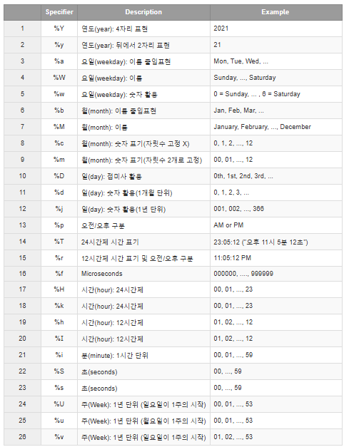
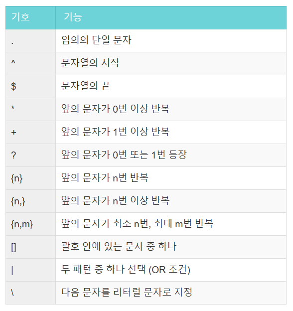

> **1. 최솟값 구하기**  
함수 : SUM, MAX, MIN

### 문제 링크

https://school.programmers.co.kr/learn/courses/30/lessons/59038

---

### 문제 설명

`ANIMAL_INS` 테이블은 동물 보호소에 들어온 동물의 정보를 담은 테이블입니다. `ANIMAL_INS` 테이블 구조는 다음과 같으며, `ANIMAL_ID`, `ANIMAL_TYPE`, `DATETIME`, `INTAKE_CONDITION`, `NAME`, `SEX_UPON_INTAKE`는 각각 동물의 아이디, 생물 종, 보호 시작일, 보호 시작 시 상태, 이름, 성별 및 중성화 여부를 나타냅니다.

|NAME|Type|Nullable|
|-|-|-|
|ANIMAL_ID|VARCHAR(N)|FALSE|
|ANIMAL_TYPE|VARCHAR(N)|FALSE|
|DATETIME|DATETIME|FALSE|
|INTAKE_CONDITION|VARCHAR(N)|FALSE|
|NAME|VARCHAR(N)|TRUE|
|SEX_UPON_INTAKE|VARCHAR(N)|FALSE|

---

### 문제

동물 보호소에 가장 먼저 들어온 동물은 언제 들어왔는지 조회하는 SQL 문을 작성해주세요.

### 풀이

```SQL
SELECT
    MIN(DATETIME)
FROM ANIMAL_INS 
```

### Point!

```
DATETIME에서 MIN 함수를 사용할 수 있음!
```

### 실행 결과

|시간|
|-|
|2013-10-14 15:38:00|

---

> **2. 동명 동물 수 찾기**  
함수 : GROUP BY

### 문제 링크

https://school.programmers.co.kr/learn/courses/30/lessons/59041

---

### 문제 설명

`ANIMAL_INS` 테이블은 동물 보호소에 들어온 동물의 정보를 담은 테이블입니다. `ANIMAL_INS` 테이블 구조는 다음과 같으며, `ANIMAL_ID`, `ANIMAL_TYPE`, `DATETIME`, `INTAKE_CONDITION`, `NAME`, `SEX_UPON_INTAKE`는 각각 동물의 아이디, 생물 종, 보호 시작일, 보호 시작 시 상태, 이름, 성별 및 중성화 여부를 나타냅니다.

|NAME|Type|Nullable|
|-|-|-|
|ANIMAL_ID|VARCHAR(N)|FALSE|
|ANIMAL_TYPE|VARCHAR(N)|FALSE|
|DATETIME|DATETIME|FALSE|
|INTAKE_CONDITION|VARCHAR(N)|FALSE|
|NAME|VARCHAR(N)|TRUE|
|SEX_UPON_INTAKE|VARCHAR(N)|FALSE|

---

### 문제

동물 보호소에 들어온 동물 이름 중 두 번 이상 쓰인 이름과 해당 이름이 쓰인 횟수를 조회하는 SQL문을 작성해주세요. 이때 결과는 이름이 없는 동물은 집계에서 제외하며, 결과는 이름 순으로 조회해주세요.

### 풀이

```SQL
SELECT
    NAME,
    COUNT(*) AS COUNT
FROM ANIMAL_INS
WHERE
    NAME IS NOT NULL
GROUP BY 
    NAME
HAVING
    COUNT >= 2
ORDER BY
    1 ASC
```

### 풀이 과정

1. 이름은 없는 동물은 제외해야 하므로 IS NOT NULL 조건 추가

```SQL
SELECT

FROM ANIMAL_INS
WHERE
    NAME IS NOT NULL
```

2. 필요한 컬럼 선택 및 횟수 계산을 위해 COUNT 함수 사용

```SQL
SELECT
    NAME,
    COUNT(*) AS COUNT
FROM ANIMAL_INS
WHERE
    NAME IS NOT NULL
GROUP BY 
    NAME
```

3. 두 번 이상 쓰인 이름을 찾기 위해 HAVING절에 조건 추가 및 오름차순 정렬 진행

```SQL
SELECT
    NAME,
    COUNT(*) AS COUNT
FROM ANIMAL_INS
WHERE
    NAME IS NOT NULL
GROUP BY 
    NAME
HAVING
    COUNT >= 2
ORDER BY
    1 ASC
```

### 실행 결과

|NAME|COUNT|
|-|-|
|Lucy|3|
|Raven|2|

---

> **3. 이름에 el이 들어간ㄴ 동물 찾기**  
함수 : String, Date

### 문제 링크

https://school.programmers.co.kr/learn/courses/30/lessons/59047

---

### 문제 설명

`ANIMAL_INS` 테이블은 동물 보호소에 들어온 동물의 정보를 담은 테이블입니다. `ANIMAL_INS` 테이블 구조는 다음과 같으며, `ANIMAL_ID`, `ANIMAL_TYPE`, `DATETIME`, `INTAKE_CONDITION`, `NAME`, `SEX_UPON_INTAKE`는 각각 동물의 아이디, 생물 종, 보호 시작일, 보호 시작 시 상태, 이름, 성별 및 중성화 여부를 나타냅니다.

|NAME|Type|Nullable|
|-|-|-|
|ANIMAL_ID|VARCHAR(N)|FALSE|
|ANIMAL_TYPE|VARCHAR(N)|FALSE|
|DATETIME|DATETIME|FALSE|
|INTAKE_CONDITION|VARCHAR(N)|FALSE|
|NAME|VARCHAR(N)|TRUE|
|SEX_UPON_INTAKE|VARCHAR(N)|FALSE|

---

### 문제

보호소에 돌아가신 할머니가 기르던 개를 찾는 사람이 찾아왔습니다. 이 사람이 말하길 할머니가 기르던 개는 이름에 'el'이 들어간다고 합니다. 동물 보호소에 들어온 동물 이름 중, 이름에 "EL"이 들어가는 개의 아이디와 이름을 조회하는 SQL문을 작성해주세요. 이때 결과는 이름 순으로 조회해주세요. 단, 이름의 대소문자는 구분하지 않습니다.

### 풀이

```SQL
SELECT
    ANIMAL_ID,
    NAME
FROM ANIMAL_INS 
WHERE
    ANIMAL_TYPE = 'Dog'
    AND NAME LIKE '%EL%'
ORDER BY
    2 ASC
```

### 풀이 과정

1. 할머니가 찾는 생물 종은 강아지이기 이름에 EL이 들어가기 때문에, 알맞게 WHERE절에 조건 추가

```SQL
SELECT

FROM ANIMAL_INS 
WHERE
    ANIMAL_TYPE = 'Dog'
    AND NAME LIKE '%EL%'
```

2. 필요한 컬럼 선택 및 이름으로 오름차순 정렬
```SQL
SELECT
    ANIMAL_ID,
    NAME
FROM ANIMAL_INS 
WHERE
    ANIMAL_TYPE = 'Dog'
    AND NAME LIKE '%EL%'
ORDER BY
    2 ASC
```

### 실행 결과

|ANIMAL_ID|NAME|
|-|-|
|A355753|Elijah|
|A382192|Maxwell 2|
|A391858|Nellie|
|A414198|Shelly|

---

> **4.NULL 처리하기**  
함수 : IS NULL

### 문제 링크

https://school.programmers.co.kr/learn/courses/30/lessons/59410

---

### 문제 설명

`ANIMAL_INS` 테이블은 동물 보호소에 들어온 동물의 정보를 담은 테이블입니다. `ANIMAL_INS` 테이블 구조는 다음과 같으며, `ANIMAL_ID`, `ANIMAL_TYPE`, `DATETIME`, `INTAKE_CONDITION`, `NAME`, `SEX_UPON_INTAKE`는 각각 동물의 아이디, 생물 종, 보호 시작일, 보호 시작 시 상태, 이름, 성별 및 중성화 여부를 나타냅니다.

|NAME|Type|Nullable|
|-|-|-|
|ANIMAL_ID|VARCHAR(N)|FALSE|
|ANIMAL_TYPE|VARCHAR(N)|FALSE|
|DATETIME|DATETIME|FALSE|
|INTAKE_CONDITION|VARCHAR(N)|FALSE|
|NAME|VARCHAR(N)|TRUE|
|SEX_UPON_INTAKE|VARCHAR(N)|FALSE|

---

### 문제

입양 게시판에 동물 정보를 게시하려 합니다. 동물의 생물 종, 이름, 성별 및 중성화 여부를 아이디 순으로 조회하는 SQL문을 작성해주세요. 이때 프로그래밍을 모르는 사람들은 NULL이라는 기호를 모르기 때문에, 이름이 없는 동물의 이름은 "No name"으로 표시해 주세요.

### 풀이

```SQL
SELECT
    ANIMAL_TYPE,
    IF (NAME IS NULL, 'No name', NAME) AS NAME,
    SEX_UPON_INTAKE
FROM ANIMAL_INS
```

### 고민했던 부분

1. REPLACE를 사용해보고 싶은데...🥲

```SQL
SELECT
    ANIMAL_TYPE,
    REPLACE(NAME, NULL, 'No name') AS NAME,
    SEX_UPON_INTAKE
FROM ANIMAL_INS
```

안되는 이유 : 

REPLACE 함수는 문자열 내에서 `특정한 문자열`을 `다른 문자열`로 바꾸는 데 사용됨. 여기서 `NULL`은 문자열이 아니라 `특별한 데이터 값`이기 때문에, REPLACE로 NULL을 처리할 수 없음...

### 추가로 알게된 내용

```SQL
COALESCE 함수 
: 하나 이상의 인수를 입력받아 NULL이 아닌 첫 번째 값을 반환환

COALESCE(value1, value2, ..., valueN)
```

1. 예시1 

```SQL
COALESCE(NAME, 'No name') AS NAME

: NAME 컬럼 값이 NULL이면 'No name'을 반환
```

2. 예시2

```SQL
SELECT COALESCE(FIRSTNAME, LASTNAME, 'Unknown') AS NAME

확인 절차 :

FIRSTNAME이 NULL 인지 확인
NULL 이 아니라면 그 값이 바로 반환되고,
NULL 이라면 LASTNAME을 확인

마찬가지로, LASTNAME이 NULL 이 아니라면 그 값이 반환되고,
NULL 이라면 'Unknown'을 반환
```

### 실행 결과

|ANIMAL_TYPE|NAME|SEX_UPON_INTAKE|
|-|-|-|
|Cat|Sugar|Neutered Male|
|Cat|Jewel|Spayed Female|
|Cat|Meo|Neutered Male|
|Dog|Harley|Spayed Female|
|.|.|.|
|.|.|.|
|.|.|.|
---

> **5.DATETIME에서 DATE로 형 변환**  
함수 : String, Date

### 문제 링크

https://school.programmers.co.kr/learn/courses/30/lessons/59414

---

### 문제 설명

`ANIMAL_INS` 테이블은 동물 보호소에 들어온 동물의 정보를 담은 테이블입니다. `ANIMAL_INS` 테이블 구조는 다음과 같으며, `ANIMAL_ID`, `ANIMAL_TYPE`, `DATETIME`, `INTAKE_CONDITION`, `NAME`, `SEX_UPON_INTAKE`는 각각 동물의 아이디, 생물 종, 보호 시작일, 보호 시작 시 상태, 이름, 성별 및 중성화 여부를 나타냅니다.

|NAME|Type|Nullable|
|-|-|-|
|ANIMAL_ID|VARCHAR(N)|FALSE|
|ANIMAL_TYPE|VARCHAR(N)|FALSE|
|DATETIME|DATETIME|FALSE|
|INTAKE_CONDITION|VARCHAR(N)|FALSE|
|NAME|VARCHAR(N)|TRUE|
|SEX_UPON_INTAKE|VARCHAR(N)|FALSE|

---

### 문제

`ANIMAL_INS` 테이블에 등록된 모든 레코드에 대해, 각 동물의 아이디와 이름, 들어온 날짜1를 조회하는 SQL문을 작성해주세요. 이때 결과는 아이디 순으로 조회해야 합니다.

### 풀이

```SQL
SELECT
    ANIMAL_ID,
    NAME,
    DATE_FORMAT(DATE(DATETIME), '%Y-%m-%d')
FROM ANIMAL_INS
ORDER BY
    1 ASC
```

### 중요 Point!

```SQL
DATE_FORMAT 함수 :
: 날짜를 지정한 형식으로 출력하는 함수
```


### 실행 결과

|ANIMAL_ID|NAME|날짜|
|-|-|-|
|A349996|Sugar|2018-01-22|
|A350276|Jewel|2017-08-13|
|A350375|Meo|2017-03-06|
|A352555|Harley|2014-08-08|
|.|.|.|
|.|.|.|
|.|.|.|

---

> **6. 가격이 제일 비싼 식품의 정보 출력하기**  
함수 : SUM, MAX, MIN

### 문제 링크

https://school.programmers.co.kr/learn/courses/30/lessons/131115

---

### 문제 설명

다음은 식품의 정보를 담은 `FOOD_PRODUCT` 테이블입니다. `FOOD_PRODUCT` 테이블은 다음과 같으며 `PRODUCT_ID`, `PRODUCT_NAME`, `PRODUCT_CD`, `CATEGORY`, `PRICE`는 식품 ID, 식품 이름, 식품 코드, 식품분류, 식품 가격을 의미합니다.

|Column name|Type|Nullable|
|-|-|-|
|PRODUCT_ID|VARCHAR(10)|FALSE|
|PRODUCT_NAME|VARCHAR(50)|FALSE|
|PRODUCT_CD|VARCHAR(10)|TRUE|
|CATEGORY|VARCHAR(10)|TRUE|
|PRICE|NUMBER|TRUE|

---

### 문제

`FOOD_PRODUCT` 테이블에서 가격이 제일 비싼 식품의 식품 ID, 식품 이름, 식품 코드, 식품분류, 식품 가격을 조회하는 SQL문을 작성해주세요.

### 풀이

```SQL
SELECT
    PRODUCT_ID,
    PRODUCT_NAME,
    PRODUCT_CD,
    CATEGORY,
    PRICE
FROM FOOD_PRODUCT 
WHERE
    PRICE = 
    (SELECT
        MAX(PRICE)
    FROM FOOD_PRODUCT)
```

### 풀이 과정

1. 가격이 가장 비싼 제품만 가져올 수 있도록 WHERE절에 조건(서브쿼리) 추가

```SQL
SELECT

FROM FOOD_PRODUCT 
WHERE
    PRICE = 
    (SELECT
        MAX(PRICE)
    FROM FOOD_PRODUCT)
```

2. 필요한 컬럼 선택

```SQL
SELECT
    PRODUCT_ID,
    PRODUCT_NAME,
    PRODUCT_CD,
    CATEGORY,
    PRICE
FROM FOOD_PRODUCT 
WHERE
    PRICE = 
    (SELECT
        MAX(PRICE)
    FROM FOOD_PRODUCT)
```

### 실행 결과

|PRODUCT_ID|PRODUCT_NAME|PRODUCT_CD|CATEGORY|PRICE|
|-|-|-|-|-|
|P0051|맛있는배추김치|CD_KC00001|김치|19000|

---

> **7. 조건에 맞는 아이템들의 가격의 종합 구하기**  
함수 : SUM, MAX, MIN

### 문제 링크

https://school.programmers.co.kr/learn/courses/30/lessons/273709

---

### 문제 설명

다음은 어느 한 게임에서 사용되는 아이템들의 아이템 정보를 담은 `ITEM_INFO` 테이블입니다. `ITEM_INFO` 테이블은 다음과 같으며, `ITEM_ID`, `ITEM_NAME`, `RARITY`, `PRICE`는 각각 아이템 ID, 아이템 명, 아이템의 희귀도, 아이템의 가격을 나타냅니다.

|Column name|Type|Nullable|
|-|-|-|
|ITEM_ID|INTEGER|FALSE|
|ITEM_NAME|VARCHAR(N)|FALSE|
|RARITY|INTEGER|FALSE|
|PRICE|INTEGER|FALSE|

---

### 문제

`ITEM_INFO` 테이블에서 희귀도가 'LEGEND'인 아이템들의 가격의 총합을 구하는 SQL문을 작성해 주세요. 이때 컬럼명은 'TOTAL_PRICE'로 지정해 주세요.

### 풀이

```SQL
SELECT
    SUM(PRICE) AS TOTAL_PRICE
FROM ITEM_INFO 
WHERE 
    RARITY = 'LEGEND'
```

### 실행 결과

|TOTAL_PRICE|
|-|
|32000|

---

> **8. 중복 제거하기**  
함수 : SUM, MAX, MIN

### 문제 링크

https://school.programmers.co.kr/learn/courses/30/lessons/59408

---

### 문제 설명

`ANIMAL_INS` 테이블은 동물 보호소에 들어온 동물의 정보를 담은 테이블입니다. `ANIMAL_INS` 테이블 구조는 다음과 같으며, `ANIMAL_ID`, `ANIMAL_TYPE`, `DATETIME`, `INTAKE_CONDITION`, `NAME`, `SEX_UPON_INTAKE`는 각각 동물의 아이디, 생물 종, 보호 시작일, 보호 시작 시 상태, 이름, 성별 및 중성화 여부를 나타냅니다.

|NAME|Type|Nullable|
|-|-|-|
|ANIMAL_ID|VARCHAR(N)|FALSE|
|ANIMAL_TYPE|VARCHAR(N)|FALSE|
|DATETIME|DATETIME|FALSE|
|INTAKE_CONDITION|VARCHAR(N)|FALSE|
|NAME|VARCHAR(N)|TRUE|
|SEX_UPON_INTAKE|VARCHAR(N)|FALSE|

---

### 문제

동물 보호소에 들어온 동물의 이름은 몇 개인지 조회하는 SQL 문을 작성해주세요. 이때 이름이 NULL인 경우는 집계하지 않으며 중복되는 이름은 하나로 칩니다.

### 풀이

```SQL
SELECT
    COUNT(DISTINCT(NAME)) AS COUNT
FROM ANIMAL_INS
WHERE
    NAME IS NOT NULL
```

### 실행 결과

|COUNT|
|-|
|96|

---

> **9. 동물 수 구하기**  
함수 : SUM, MAX, MIN

### 문제 링크

https://school.programmers.co.kr/learn/courses/30/lessons/59406

---

### 문제 설명

`ANIMAL_INS` 테이블은 동물 보호소에 들어온 동물의 정보를 담은 테이블입니다. `ANIMAL_INS` 테이블 구조는 다음과 같으며, `ANIMAL_ID`, `ANIMAL_TYPE`, `DATETIME`, `INTAKE_CONDITION`, `NAME`, `SEX_UPON_INTAKE`는 각각 동물의 아이디, 생물 종, 보호 시작일, 보호 시작 시 상태, 이름, 성별 및 중성화 여부를 나타냅니다.

|NAME|Type|Nullable|
|-|-|-|
|ANIMAL_ID|VARCHAR(N)|FALSE|
|ANIMAL_TYPE|VARCHAR(N)|FALSE|
|DATETIME|DATETIME|FALSE|
|INTAKE_CONDITION|VARCHAR(N)|FALSE|
|NAME|VARCHAR(N)|TRUE|
|SEX_UPON_INTAKE|VARCHAR(N)|FALSE|

---

### 문제

동물 보호소에 동물이 몇 마리 들어왔는지 조회하는 SQL 문을 작성해주세요.

### 풀이

```SQL
SELECT
    COUNT(*) AS COUNT
FROM ANIMAL_INS 
```

### 실행 결과

|COUNT|
|-|
|100|

---

> **10. 카테고리 별 상품 개수 구하기기**  
함수 : String, Date

### 문제 링크

https://school.programmers.co.kr/learn/courses/30/lessons/131529

---

### 문제 설명

다음은 어느 의류 쇼핑몰에서 판매중인 상품들의 정보를 담은 `PRODUCT` 테이블입니다. `PRODUCT` 테이블은 아래와 같은 구조로 되어있으며, `PRODUCT_ID`, `PRODUCT_CODE`, `PRICE`는 각각 상품 ID, 상품코드, 판매가를 나타냅니다.

|Column name|Type|Nullable|
|-|-|-|
|PRODUCT_ID|INTEGER|FALSE|
|PRODUCT_CODE|VARCHAR(8)|FALSE|
|PRICE|INTEGER|FALSE|

상품 별로 중복되지 않는 8자리 상품코드 값을 가지며, 앞 2자리는 카테고리 코드를 의미합니다.

---

### 문제

`PRODUCT` 테이블에서 상품 카테고리 코드(`PRODUCT_CODE` 앞 2자리) 별 상품 개수를 출력하는 SQL문을 작성해주세요. 결과는 상품 카테고리 코드를 기준으로 오름차순 정렬해주세요.

### 풀이

```SQL
SELECT
    SUBSTRING(PRODUCT_CODE, 1, 2) AS CATEGORY,
    COUNT(*) AS PRODUCTS
FROM PRODUCT 
GROUP BY 
    CATEGORY
ORDER BY
    1 ASC
```

### 실행 결과

|FLAVOR|
|-|
|strawberry|

|CATEGORY|PRODUCTS|
|-|-|
|A2|3|
|A3|4|
|B1|1|
|B2|3|
|C1|2|
|C2|2|
|C3|4|
|C4|3|
|D1|3|
|D2|2|
|D3|3|

---

> **11. 진료과별 총 예약 횟수 출력하기**  
함수 : GROUP BY

### 문제 링크

https://school.programmers.co.kr/learn/courses/30/lessons/132202

---

### 문제 설명

다음은 종합병원의 진료 예약정보를 담은 `APPOINTMENT` 테이블 입니다.
`APPOINTMENT` 테이블은 다음과 같으며 `APNT_YMD`, `APNT_NO`, `PT_NO`, `MCDP_CD`, `MDDR_ID`, `APNT_CNCL_YN`, `APNT_CNCL_YMD`는 각각 진료예약일시, 진료예약번호, 환자번호, 진료과코드, 의사ID, 예약취소여부, 예약취소날짜를 나타냅니다.

|Column name|Type|Nullable|
|-|-|-|
|APNT_YMD|TIMESTAMP|FALSE|
|APNT_NO|NUMBER(5)|FALSE|
|PT_NO|VARCHAR(10)|FALSE|
|MCDP_CD|VARCHAR(6)|FALSE|
|MDDR_ID|VARCHAR(10)|FALSE|
|APNT_CNCL_YN|VARCHAR(1)|TRUE|
|APNT_CNCL_YMD|DATE|TRUE|

---

### 문제

`APPOINTMENT` 테이블에서 2022년 5월에 예약한 환자 수를 진료과코드 별로 조회하는 SQL문을 작성해주세요. 이때, 컬럼명은 '진료과 코드', '5월예약건수'로 지정해주시고 결과는 진료과별 예약한 환자 수를 기준으로 오름차순 정렬하고, 예약한 환자 수가 같다면 진료과 코드를 기준으로 오름차순 정렬해주세요.

### 풀이

```SQL
SELECT
    MCDP_CD AS 진료과코드,
    COUNT(*) AS 5월예약건수
FROM APPOINTMENT
WHERE 
    EXTRACT(YEAR FROM APNT_YMD) = 2022
    AND EXTRACT(MONTH FROM APNT_YMD) = 5
GROUP BY
    진료과코드
ORDER BY
    2 ASC,
    1 ASC
```

### 풀이 과정

1. 2022년 5월에 예약한 환자를 찾기 위해 EXTRACT 함수 사용용

```SQL
SELECT

FROM APPOINTMENT
WHERE 
    EXTRACT(YEAR FROM APNT_YMD) = 2022
    AND EXTRACT(MONTH FROM APNT_YMD) = 5
```

2. 필요한 컬럼 선택 및 진료과별 환자 수를 계산하기 위해 진료과코드로 GROUP BY 진행

```SQL
SELECT
    MCDP_CD AS 진료과코드,
    COUNT(*) AS 5월예약건수
FROM APPOINTMENT
WHERE 
    EXTRACT(YEAR FROM APNT_YMD) = 2022
    AND EXTRACT(MONTH FROM APNT_YMD) = 5
GROUP BY
    진료과코드
```

3. 마지막으로 오름차순 정렬 추가

```SQL
SELECT
    MCDP_CD AS 진료과코드,
    COUNT(*) AS 5월예약건수
FROM APPOINTMENT
WHERE 
    EXTRACT(YEAR FROM APNT_YMD) = 2022
    AND EXTRACT(MONTH FROM APNT_YMD) = 5
GROUP BY
    진료과코드
ORDER BY
    2 ASC,
    1 ASC
```

### 실행 결과

|진료과코드|5월예약건수|
|-|-|
|FM|2|
|GS|2|

---

> **12. 고양이와 개는 몇 마리 있을까**  
함수 : GROUP BY

### 문제 링크

https://school.programmers.co.kr/learn/courses/30/lessons/59040

---

### 문제 설명

`ANIMAL_INS` 테이블은 동물 보호소에 들어온 동물의 정보를 담은 테이블입니다. `ANIMAL_INS` 테이블 구조는 다음과 같으며, `ANIMAL_ID`, `ANIMAL_TYPE`, `DATETIME`, `INTAKE_CONDITION`, `NAME`, `SEX_UPON_INTAKE`는 각각 동물의 아이디, 생물 종, 보호 시작일, 보호 시작 시 상태, 이름, 성별 및 중성화 여부를 나타냅니다.

|NAME|Type|Nullable|
|-|-|-|
|ANIMAL_ID|VARCHAR(N)|FALSE|
|ANIMAL_TYPE|VARCHAR(N)|FALSE|
|DATETIME|DATETIME|FALSE|
|INTAKE_CONDITION|VARCHAR(N)|FALSE|
|NAME|VARCHAR(N)|TRUE|
|SEX_UPON_INTAKE|VARCHAR(N)|FALSE|

---

### 문제

동물 보호소에 들어온 동물 중 고양이와 개가 각각 몇 마리인지 조회하는 SQL문을 작성해주세요. 이때 고양이를 개보다 먼저 조회해주세요.

### 풀이

```SQL
SELECT
    ANIMAL_TYPE,
    COUNT(*) AS count
FROM ANIMAL_INS
WHERE
    ANIMAL_TYPE IN ('Cat', 'Dog')
GROUP BY
    ANIMAL_TYPE
ORDER BY
    1 ASC
```

### 풀이 과정

1. 동물 중에서 고양이와 개를 필터링해야 하므로 WHERE 절에 조건 추가

```SQL
SELECT

FROM ANIMAL_INS
WHERE
    ANIMAL_TYPE IN ('Cat', 'Dog')
```

2. 필요한 컬럼 선택 및 동물 타입별로 개수를 세야 하므로 COUNT와 GROUP BY 함수 추가

```SQL
SELECT
    ANIMAL_TYPE,
    COUNT(*) AS count
FROM ANIMAL_INS
WHERE
    ANIMAL_TYPE IN ('Cat', 'Dog')
GROUP BY
    ANIMAL_TYPE
```

3. 마지막으로 고양이를 개보다 먼저 조화하기 위해 오름차순 정렬 진행

```SQL
SELECT
    ANIMAL_TYPE,
    COUNT(*) AS count
FROM ANIMAL_INS
WHERE
    ANIMAL_TYPE IN ('Cat', 'Dog')
GROUP BY
    ANIMAL_TYPE
ORDER BY
    1 ASC
```

### 실행 결과

|ANIMAL_TYPE|count|
|-|-|
|Cat|15|
|Dog|85|

---

> **13. 중성화 여부 파악하기**  
함수 : String, Date

### 문제 링크

https://school.programmers.co.kr/learn/courses/30/lessons/59409

---

### 문제 설명

`ANIMAL_INS` 테이블은 동물 보호소에 들어온 동물의 정보를 담은 테이블입니다. `ANIMAL_INS` 테이블 구조는 다음과 같으며, `ANIMAL_ID`, `ANIMAL_TYPE`, `DATETIME`, `INTAKE_CONDITION`, `NAME`, `SEX_UPON_INTAKE`는 각각 동물의 아이디, 생물 종, 보호 시작일, 보호 시작 시 상태, 이름, 성별 및 중성화 여부를 나타냅니다.

|NAME|Type|Nullable|
|-|-|-|
|ANIMAL_ID|VARCHAR(N)|FALSE|
|ANIMAL_TYPE|VARCHAR(N)|FALSE|
|DATETIME|DATETIME|FALSE|
|INTAKE_CONDITION|VARCHAR(N)|FALSE|
|NAME|VARCHAR(N)|TRUE|
|SEX_UPON_INTAKE|VARCHAR(N)|FALSE|

---

### 문제

보호소의 동물이 중성화되었는지 아닌지 파악하려 합니다. 중성화된 동물은 `SEX_UPON_INTAKE` 컬럼에 'Neutered' 또는 'Spayed'라는 단어가 들어있습니다. 동물의 아이디와 이름, 중성화 여부를 아이디 순으로 조회하는 SQL문을 작성해주세요. 이때 중성화가 되어있다면 'O', 아니라면 'X'라고 표시해주세요.

### 풀이

```SQL
SELECT
    ANIMAL_ID,
    NAME,
    IF(SEX_UPON_INTAKE REGEXP'(Neutered|Spayed)', 'O', 'X') AS 중성화
FROM ANIMAL_INS
ORDER BY
    1 ASC
```

### 실행 결과

|ANIMAL_ID|NAME|중성화|
|-|-|-|
|A349996|Sugar|O|
|A350276|Jewel|O|
|A350375|Meo|O|
|A352555|Harley|O|
|.|.|.|
|.|.|.|
|.|.|.|

---

> **14. 입양 시각 구하기(1)**  
함수 : GROUP BY

### 문제 링크

https://school.programmers.co.kr/learn/courses/30/lessons/59412

---

### 문제 설명

`ANIMAL_INS` 테이블은 동물 보호소에 들어온 동물의 정보를 담은 테이블입니다. `ANIMAL_INS` 테이블 구조는 다음과 같으며, `ANIMAL_ID`, `ANIMAL_TYPE`, `DATETIME`, `INTAKE_CONDITION`, `NAME`, `SEX_UPON_INTAKE`는 각각 동물의 아이디, 생물 종, 보호 시작일, 보호 시작 시 상태, 이름, 성별 및 중성화 여부를 나타냅니다.

|NAME|Type|Nullable|
|-|-|-|
|ANIMAL_ID|VARCHAR(N)|FALSE|
|ANIMAL_TYPE|VARCHAR(N)|FALSE|
|DATETIME|DATETIME|FALSE|
|INTAKE_CONDITION|VARCHAR(N)|FALSE|
|NAME|VARCHAR(N)|TRUE|
|SEX_UPON_INTAKE|VARCHAR(N)|FALSE|

---

### 문제

보호소에서는 몇 시에 입양이 가장 활발하게 일어나는지 알아보려 합니다. 09:00부터 19:59까지, 각 시간대별로 입양이 몇 건이나 발생했는지 조회하는 SQL문을 작성해주세요. 이때 결과는 시간대 순으로 정렬해야 합니다

### 풀이

```SQL
SELECT
    EXTRACT(HOUR FROM DATETIME) AS HOUR,
    COUNT(*) AS COUNT
FROM ANIMAL_OUTS
WHERE
    EXTRACT(HOUR FROM DATETIME) BETWEEN 9 AND 19
GROUP BY
    1
ORDER BY
    1 ASC
```

### 풀이 과정

1. 9시부터 19시 사이만 고려해야 하므로 WHERE절에 조건 추가

```SQL
SELECT

FROM ANIMAL_OUTS
WHERE
    EXTRACT(HOUR FROM DATETIME) BETWEEN 9 AND 19
```

2. 시간대별로 카운트를 해야하므로 GROUP BY 추가 및 오름차순 정렬 진행

```SQL
SELECT
    EXTRACT(HOUR FROM DATETIME) AS HOUR,
    COUNT(*) AS COUNT
FROM ANIMAL_OUTS
WHERE
    EXTRACT(HOUR FROM DATETIME) BETWEEN 9 AND 19
GROUP BY
    1
ORDER BY
    1 ASC
```

### 실행 결과

|HOUR|COUNT|
|-|-|
|9|1|
|10|2|
|11|13|
|12|10|
|.|.|
|.|.|
|.|.|

---

> **15. 조건에 맞는 도서와 저자 리스트 출력하기**  
함수 : JOIN

### 문제 링크

https://school.programmers.co.kr/learn/courses/30/lessons/144854

---

### 문제 설명

다음은 어느 한 서점에서 판매중인 도서들의 도서 정보(`BOOK`), 저자 정보(`AUTHOR`) 테이블입니다.

`BOOK` 테이블은 각 도서의 정보를 담은 테이블로 아래와 같은 구조로 되어있습니다.

|Column name|Type|Nullable|Description|
|-|-|-|-|
|BOOK_ID|INTEGER|FALSE|도서 ID|
|CATEGORY|VARCHAR(N)|FALSE|카테고리 (경제, 인문, 소설, 생활, 기술)|
|AUTHOR_ID|INTEGER|FALSE|저자 ID|
|PRICE|INTEGER|FALSE|판매가 (원)|
|PUBLISHED_DATE|DATE|FALSE|출판일|

`AUTHOR` 테이블은 도서의 저자의 정보를 담은 테이블로 아래와 같은 구조로 되어있습니다.

|Column name|Type|Nullable|Description|
|-|-|-|-|
|AUTHOR_ID|INTEGER|FALSE|저자자 ID|
|AUTHOR_NAME|VARCHAR(N)|FALSE|저자명|

---

### 문제

`'경제'` 카테고리에 속하는 도서들의 도서 ID(`BOOK_ID`), 저자명(`AUTHOR_NAME`), 출판일(`PUBLISHED_DATE`) 리스트를 출력하는 SQL문을 작성해주세요.
결과는 출판일을 기준으로 오름차순 정렬해주세요.

### 풀이

```SQL
SELECT
    BOOK_ID,
    AUTHOR_NAME,
    DATE_FORMAT(PUBLISHED_DATE, '%Y-%m-%d') AS PUBLISHED_DATE
FROM BOOK AS B
LEFT JOIN AUTHOR AS A
ON B.AUTHOR_ID = A.AUTHOR_ID
WHERE 
    CATEGORY = '경제'
ORDER BY
    3 ASC
```

### 풀이 과정

1. 공통된 AUTHOR_ID를 기준으로 두 테이블을 JOIN하고 카테고리가 `경제`인 것만 필터링

```SQL
SELECT

FROM BOOK AS B
LEFT JOIN AUTHOR AS A
ON B.AUTHOR_ID = A.AUTHOR_ID
WHERE 
    CATEGORY = '경제'
```

2. 필요한 컬럼 선택 및 예시와 동일하게 데이트 포맷 변경

```SQL
SELECT
    BOOK_ID,
    AUTHOR_NAME,
    DATE_FORMAT(PUBLISHED_DATE, '%Y-%m-%d') AS PUBLISHED_DATE
FROM BOOK AS B
LEFT JOIN AUTHOR AS A
ON B.AUTHOR_ID = A.AUTHOR_ID
WHERE 
    CATEGORY = '경제'
```

3. 마지막으로 출판일을 기준으로 오름차순 정렬 진행

```SQL
SELECT
    BOOK_ID,
    AUTHOR_NAME,
    DATE_FORMAT(PUBLISHED_DATE, '%Y-%m-%d') AS PUBLISHED_DATE
FROM BOOK AS B
LEFT JOIN AUTHOR AS A
ON B.AUTHOR_ID = A.AUTHOR_ID
WHERE 
    CATEGORY = '경제'
ORDER BY
    3 ASC
```

### 실행 결과

|BOOK_ID|AUTHOR_NAME|PUBLISHED_DATE|
|-|-|-|
|1|홍길동|2020-01-10|
|2|홍길동|2021-06-10|

---

> **16. 상품 별 오프라인 매출 구하기**  
함수 : JOIN

### 문제 링크

https://school.programmers.co.kr/learn/courses/30/lessons/131533

---

### 문제 설명

다음은 어느 의류 쇼핑몰에서 판매중인 상품들의 상품 정보를 담은 `PRODUCT` 테이블과 오프라인 상품 판매 정보를 담은 `OFFLINE_SALE` 테이블 입니다. `PRODUCT` 테이블은 아래와 같은 구조로 `PRODUCT_ID`, `PRODUCT_CODE`, `PRICE`는 각각 상품 ID, 상품코드, 판매가를 나타냅니다.

|Column name|Type|Nullable|
|-|-|-|
|PRODUCT_ID|INTEGER|FALSE|
|PRODUCT_CODE|VARCHAR(8)|FALSE|
|PRICE|INTEGER|FALSE|

상품 별로 중복되지 않는 8자리 상품코드 값을 가지며, 앞 2자리는 카테고리 코드를 의미합니다.

`OFFLINE_SALE` 테이블은 아래와 같은 구조로 되어있으며 `OFFLINE_SALE_ID`, `PRODUCT_ID`, `SALES_AMOUNT`, `SALES_DATE`는 각각 오프라인 상품 판매 ID, 상품 ID, 판매량, 판매일을 나타냅니다.

|Column name|Type|Nullable|
|-|-|-|
|OFFLINE_SALE_ID|INTEGER|FALSE|
|PRODUCT_ID|INTEGER|FALSE|
|SALES_AMOUNT|INTEGER|FALSE|
|SALES_DATE|DATE|FALSE|

동일한 날짜, 상품 ID 조합에 대해서는 하나의 판매 데이터만 존재합니다.

---

### 문제

`PRODUCT` 테이블과 `OFFLINE_SALE` 테이블에서 상품코드 별 매출액(판매가 * 판매량) 합계를 출력하는 SQL문을 작성해주세요. 결과는 매출액을 기준으로 내림차순 정렬해주시고 매출액이 같다면 상품코드를 기준으로 오름차순 정렬해주세요.

### 풀이

```SQL
SELECT
    PRODUCT_CODE,
    SUM(PRICE * SALES_AMOUNT) AS SALES
FROM PRODUCT AS P
LEFT JOIN OFFLINE_SALE AS OS
ON P.PRODUCT_ID = OS.PRODUCT_ID
GROUP BY
    1
ORDER BY
    2 DESC,
    1 ASC
```

### 풀이 과정

1. 공통된 키 값인 PRODUCT_ID로 JOIN 진행

```SQL
SELECT

FROM PRODUCT AS P
LEFT JOIN OFFLINE_SALE AS OS
ON P.PRODUCT_ID = OS.PRODUCT_ID
```

2. 상품코드 별로 매출액 계산 및 합계를 출력하기 위해 SUM, GROUP BY 사용

```SQL
SELECT
    PRODUCT_CODE,
    SUM(PRICE * SALES_AMOUNT) AS SALES
FROM PRODUCT AS P
LEFT JOIN OFFLINE_SALE AS OS
ON P.PRODUCT_ID = OS.PRODUCT_ID
GROUP BY
    1
```

3. 마지막으로 내림차순, 오름차순 정렬 추가

```SQL
SELECT
    PRODUCT_CODE,
    SUM(PRICE * SALES_AMOUNT) AS SALES
FROM PRODUCT AS P
LEFT JOIN OFFLINE_SALE AS OS
ON P.PRODUCT_ID = OS.PRODUCT_ID
GROUP BY
    1
ORDER BY
    2 DESC,
    1 ASC
```

### 실행 결과

|PRODUCT_CODE|SALES|
|-|-|
|D1000000|504000|
|D3000001|425000|
|C2000000|360000|
|C3000003|330000|
|.|.|
|.|.|
|.|.|

---

> **17. 성분으로 구분한 아이스크림 총 주문량**  
함수 : GROUP BY

### 문제 링크

https://school.programmers.co.kr/learn/courses/30/lessons/133026

---

### 문제 설명

다음은 아이스크림 가게의 상반기 주문 정보를 담은 `FIRST_HALF` 테이블과 아이스크림 성분에 대한 정보를 담은 `ICECREAM_INFO` 테이블입니다. `FIRST_HALF` 테이블 구조는 다음과 같으며, `SHIPMENT_ID`, `FLAVOR`, `TOTAL_ORDER` 는 각각 아이스크림 공장에서 아이스크림 가게까지의 출하 번호, 아이스크림 맛, 상반기 아이스크림 총주문량을 나타냅니다. `FIRST_HALF` 테이블의 기본 키는 `FLAVOR`입니다.

|NAME|Type|Nullable|
|-|-|-|
|SHIPMENT_ID|INT(N)|FALSE|
|FLAVOR|VARCHAR(N)|FALSE|
|TOTAL_ORDER|INT(N)|FALSE|

`ICECREAM_INFO` 테이블 구조는 다음과 같으며, `FLAVOR`, `INGREDITENT_TYPE` 은 각각 아이스크림 맛, 아이스크림의 성분 타입을 나타냅니다. `INGREDIENT_TYPE`에는 아이스크림의 주 성분이 설탕이면 `sugar_based`라고 입력되고, 아이스크림의 주 성분이 과일이면 `fruit_based`라고 입력됩니다. `ICECREAM_INFO`의 기본 키는 `FLAVOR`입니다. `ICECREAM_INFO`테이블의 `FLAVOR`는 `FIRST_HALF` 테이블의 `FLAVOR`의 외래 키입니다.

|NAME|Type|Nullable|
|-|-|-|
|FLAVOR|VARCHAR(N)|FALSE|
|INGREDIENT_TYPE|VARCHAR(N)|FALSE|

---

### 문제

상반기 동안 각 아이스크림 성분 타입과 성분 타입에 대한 아이스크림의 총주문량을 총주문량이 작은 순서대로 조회하는 SQL 문을 작성해주세요. 이때 총주문량을 나타내는 컬럼명은 TOTAL_ORDER로 지정해주세요.

### 풀이

```SQL
SELECT
    INGREDIENT_TYPE,
    SUM(TOTAL_ORDER) AS TOTAL_ORDER
FROM FIRST_HALF AS FH
LEFT JOIN ICECREAM_INFO AS II
ON FH.FLAVOR = II.FLAVOR
GROUP BY
    1
ORDER BY
    2 ASC
```

### 풀이 과정

1. 공통된 키인 FLAVOR로 JOIN 진행

```SQL
SELECT

FROM FIRST_HALF AS FH
LEFT JOIN ICECREAM_INFO AS II
ON FH.FLAVOR = II.FLAVOR
```

2. 성분 타입 별 주문량 합계를 계산해야 하므로 SUM, GROUP BY 함수 활용

```SQL
SELECT
    INGREDIENT_TYPE,
    SUM(TOTAL_ORDER) AS TOTAL_ORDER
FROM FIRST_HALF AS FH
LEFT JOIN ICECREAM_INFO AS II
ON FH.FLAVOR = II.FLAVOR
GROUP BY
    1
```

3. 마지막으로 총주문량 기준으로 오름차순 정렬 진행

```SQL
SELECT
    INGREDIENT_TYPE,
    SUM(TOTAL_ORDER) AS TOTAL_ORDER
FROM FIRST_HALF AS FH
LEFT JOIN ICECREAM_INFO AS II
ON FH.FLAVOR = II.FLAVOR
GROUP BY
    1
ORDER BY
    2 ASC
```

### 실행 결과

|INGREDIENT_TYPE|TOTAL_ORDER|
|-|
|fruit_based|5550|
|sugar_based|13400|

---

> **18. 3월에 태어난 여성 회원 목록 출력하기**  
함수 : SELECT

### 문제 링크

https://school.programmers.co.kr/learn/courses/30/lessons/131120

---

### 문제 설명

다음은 식당 리뷰 사이트의 회원 정보를 담은 `MEMBER_PROFILE` 테이블입니다. `MEMBER_PROFILE` 테이블은 다음과 같으며 `MEMBER_ID`, `MEMBER_NAME`, `TLNO`, `GENDER`, `DATE_OF_BIRTH`는 회원 ID, 회원 이름, 회원 연락처, 성별, 생년월일을 의미합니다.

|Column name|Type|Nullable|
|-|-|-|
|MEMBER_ID|VARCHAR(100)|FALSE|
|MEMBER_NAME|VARCHAR(50)|FALSE|
|TLNO|VARCHAR(50)|TRUE|
|GENDER|VARCHAR(1)|TRUE|
|DATE_OF_BIRTH|DATE|TRUE|

---

### 문제

`MEMBER_PROFILE` 테이블에서 생일이 3월인 여성 회원의 ID, 이름, 성별, 생년월일을 조회하는 SQL문을 작성해주세요. 이때 전화번호가 NULL인 경우는 출력대상에서 제외시켜 주시고, 결과는 회원ID를 기준으로 오름차순 정렬해주세요.

### 풀이

```SQL
SELECT
    MEMBER_ID,
    MEMBER_NAME,
    GENDER,
    DATE_FORMAT(DATE_OF_BIRTH, '%Y-%m-%d') AS DATE_OF_BIRTH
FROM MEMBER_PROFILE
WHERE
    TLNO IS NOT NULL
    AND EXTRACT(MONTH FROM DATE_OF_BIRTH) = 3
    AND GENDER = 'W'
ORDER BY
    1 ASC
```

### 풀이 과정

1. 문제에 맞게 세 가지 조건 추가

- (1) 전화번호가 NULL이 아닐 것
- (2) 생일이 3월일 것
- (3) 성별이 여자일 것

```SQL
SELECT

FROM MEMBER_PROFILE
WHERE
    TLNO IS NOT NULL
    AND EXTRACT(MONTH FROM DATE_OF_BIRTH) = 3
    AND GENDER = 'W'
```

2. 필요한 컬럼 선택 및 데이트 포맷에 맞게 변환

```SQL
SELECT
    MEMBER_ID,
    MEMBER_NAME,
    GENDER,
    DATE_FORMAT(DATE_OF_BIRTH, '%Y-%m-%d') AS DATE_OF_BIRTH
FROM MEMBER_PROFILE
WHERE
    TLNO IS NOT NULL
    AND EXTRACT(MONTH FROM DATE_OF_BIRTH) = 3
    AND GENDER = 'W'
```

3. 마지막으로 오름차순 정렬 진행

```SQL
SELECT
    MEMBER_ID,
    MEMBER_NAME,
    GENDER,
    DATE_FORMAT(DATE_OF_BIRTH, '%Y-%m-%d') AS DATE_OF_BIRTH
FROM MEMBER_PROFILE
WHERE
    TLNO IS NOT NULL
    AND EXTRACT(MONTH FROM DATE_OF_BIRTH) = 3
    AND GENDER = 'W'
ORDER BY
    1 ASC
```

### 실행 결과

|MEMBER_ID|MEMBER_NAME|GENDER|DATE_OF_BIRTH|
|-|-|-|-|
|seoyeons@naver.com|박서연|W|1992-03-16|

---

> **19. 루시와 엘라 찾기**  
함수 : String, Date

### 문제 링크

https://school.programmers.co.kr/learn/courses/30/lessons/59046

---

### 문제 설명

`ANIMAL_INS` 테이블은 동물 보호소에 들어온 동물의 정보를 담은 테이블입니다. `ANIMAL_INS` 테이블 구조는 다음과 같으며, `ANIMAL_ID`, `ANIMAL_TYPE`, `DATETIME`, `INTAKE_CONDITION`, `NAME`, `SEX_UPON_INTAKE`는 각각 동물의 아이디, 생물 종, 보호 시작일, 보호 시작 시 상태, 이름, 성별 및 중성화 여부를 나타냅니다.

|NAME|Type|Nullable|
|-|-|-|
|ANIMAL_ID|VARCHAR(N)|FALSE|
|ANIMAL_TYPE|VARCHAR(N)|FALSE|
|DATETIME|DATETIME|FALSE|
|INTAKE_CONDITION|VARCHAR(N)|FALSE|
|NAME|VARCHAR(N)|TRUE|
|SEX_UPON_INTAKE|VARCHAR(N)|FALSE|

---

### 문제

동물 보호소에 들어온 동물 중 이름이 Lucy, Ella, Pickle, Rogan, Sabrina, Mitty인 동물의 아이디와 이름, 성별 및 중성화 여부를 조회하는 SQL 문을 작성해주세요.

### 풀이

```SQL
SELECT
    ANIMAL_ID,
    NAME,
    SEX_UPON_INTAKE
FROM ANIMAL_INS
WHERE
    NAME IN ('Lucy', 'Ella', 'Pickle', 'Rogan', 'Sabrina', 'Mitty')
ORDER BY
    1 ASC
```

### 풀이 과정

1. 이름이 Lucy, Ella, Pickle, Rogan, Sabrina, Mitty인 동물을 필터링하기 위해 IN 활용용

```SQL
SELECT

FROM ANIMAL_INS
WHERE
    NAME IN ('Lucy', 'Ella', 'Pickle', 'Rogan', 'Sabrina', 'Mitty')
```

2. 필요한 컬럼 선택 및 아이디를 기준으로 오름차순 정렬 진행

```SQL
SELECT
    ANIMAL_ID,
    NAME,
    SEX_UPON_INTAKE
FROM ANIMAL_INS
WHERE
    NAME IN ('Lucy', 'Ella', 'Pickle', 'Rogan', 'Sabrina', 'Mitty')
ORDER BY
    1 ASC
```

### 고민했던 부분

```SQL
SELECT
    ANIMAL_ID,
    NAME,
    SEX_UPON_INTAKE
FROM ANIMAL_INS 
WHERE
    NAME REGEXP'(Lucy|Ella|Pickle|Rogan|Sabrina|Mitty)'
ORDER BY
    1 ASC
```

안되는 이유 :

`REGEXP`는 `지정한 문자열이 포함`되기만 하면 결과로 출력함

이 때문에 `Lucyanna`도 `Lucy`가 포함되므로 이 또한 결과에 포함됨

### 실행 결과

|ANIMAL_ID|NAME|SEX_UPON_INTAKE|
|-|-|-|
|A373219|Ella|Spayed Female|
|A377750|Lucy|Spayed Female|
|A380009|Pickle|Spayed Female|
|A395451|Rogan|Neutered Male|
|A399421|Lucy|Spayed Female|
|A400680|Lucy|Spayed Female|
|A406756|Sabrina|Spayed Female|
|A410684|Mitty|Spayed Female|

---

> **20. 오랜 기간 보호한 동물(1)**  
함수 : JOIN

### 문제 링크

https://school.programmers.co.kr/learn/courses/30/lessons/59044

---

### 문제 설명

`ANIMAL_INS` 테이블은 동물 보호소에 들어온 동물의 정보를 담은 테이블입니다. `ANIMAL_INS` 테이블 구조는 다음과 같으며, `ANIMAL_ID`, `ANIMAL_TYPE`, `DATETIME`, `INTAKE_CONDITION`, `NAME`, `SEX_UPON_INTAKE`는 각각 동물의 아이디, 생물 종, 보호 시작일, 보호 시작 시 상태, 이름, 성별 및 중성화 여부를 나타냅니다.

|NAME|Type|Nullable|
|-|-|-|
|ANIMAL_ID|VARCHAR(N)|FALSE|
|ANIMAL_TYPE|VARCHAR(N)|FALSE|
|DATETIME|DATETIME|FALSE|
|INTAKE_CONDITION|VARCHAR(N)|FALSE|
|NAME|VARCHAR(N)|TRUE|
|SEX_UPON_INTAKE|VARCHAR(N)|FALSE|

`ANIMAL_OUTS` 테이블은 동물 보호소에서 입양 보낸 동물의 정보를 담은 테이블입니다. `ANIMAL_OUTS` 테이블 구조는 다음과 같으며, `ANIMAL_ID`, `ANIMAL_TYPE`, `DATETIME`, `NAME`, `SEX_UPON_OUTCOME`는 각각 동물의 아이디, 생물 종, 입양일, 이름, 성별 및 중성화 여부를 나타냅니다. `ANIMAL_OUTS` 테이블의 `ANIMAL_ID`는 `ANIMAL_INS`의 `ANIMAL_ID`의 외래 키입니다.

|NAME|Type|Nullable|
|-|-|-|
|ANIMAL_ID|VARCHAR(N)|FALSE|
|ANIMAL_TYPE|VARCHAR(N)|FALSE|
|DATETIME|DATETIME|FALSE|
|NAME|VARCHAR(N)|TRUE|
|SEX_UPON_INTAKE|VARCHAR(N)|FALSE|

---

### 문제

아직 입양을 못 간 동물 중, 가장 오래 보호소에 있었던 동물 3마리의 이름과 보호 시작일을 조회하는 SQL문을 작성해주세요. 이때 결과는 보호 시작일 순으로 조회해야 합니다.

### 풀이1

```SQL
SELECT
    AI.NAME,
    AI.DATETIME
FROM ANIMAL_INS AS AI
LEFT JOIN ANIMAL_OUTS AS AO
ON AI.ANIMAL_ID = AO.ANIMAL_ID
WHERE
    AO.ANIMAL_ID IS NULL
ORDER BY
    2 ASC
LIMIT
    3
```

### 풀이 과정

1. 공통된 키값인 ANIMAL_ID을 활용해 JOIN 진행

```SQL
SELECT

FROM ANIMAL_INS AS AI
LEFT JOIN ANIMAL_OUTS AS AO
ON AI.ANIMAL_ID = AO.ANIMAL_ID
```

2. JOIN을 하게 되면 추가된 AO 테이블 데이터에는 NULL이 발생 -> 이 NULL을 활용해 차집합을 구함! 

```SQL
SELECT

FROM ANIMAL_INS AS AI
LEFT JOIN ANIMAL_OUTS AS AO
ON AI.ANIMAL_ID = AO.ANIMAL_ID
WHERE
    AO.ANIMAL_ID IS NULL
```

3. 필요한 컬럼 선택 및 조건에 맞게 정렬 및 LIMIT 함수 추가

```SQL
SELECT
    AI.NAME,
    AI.DATETIME
FROM ANIMAL_INS AS AI
LEFT JOIN ANIMAL_OUTS AS AO
ON AI.ANIMAL_ID = AO.ANIMAL_ID
WHERE
    AO.ANIMAL_ID IS NULL
ORDER BY
    2 ASC
LIMIT
    3
```

### 풀이2

```SQL
SELECT
    NAME,
    DATETIME
FROM ANIMAL_INS
WHERE 
    ANIMAL_ID NOT IN(
        SELECT
            DISTINCT ANIMAL_ID
        FROM ANIMAL_OUTS
    )
ORDER BY
    2 ASC
LIMIT
    3
```

### 풀이 과정

1. JOIN없이 WHERE절에 조건을 넣어 ANIMAL_ID를 필터링!

```SQL
SELECT

FROM ANIMAL_INS
WHERE 
    ANIMAL_ID NOT IN(
        SELECT
            DISTINCT ANIMAL_ID
        FROM ANIMAL_OUTS
    )
```

2. 나머지는 동일~

```SQL
SELECT
    NAME,
    DATETIME
FROM ANIMAL_INS
WHERE 
    ANIMAL_ID NOT IN(
        SELECT
            DISTINCT ANIMAL_ID
        FROM ANIMAL_OUTS
    )
ORDER BY
    2 ASC
LIMIT
    3
```

### 실행 결과

|NAME|DATETIME|
|-|-|
|Shelly|2015-01-29 15:01:00|
|Jackie|2016-01-03 16:25:00|
|Benji|2016-04-19 13:28:00|

---

> **추가 공부사항**  

#### 정규표현식

참고자료 출처 : https://webcodur.tistory.com/82

```
정규표현식이란?

: 텍스트 데이터 중에서 원하는 조건과 일치하는 문자열을 찾기 위해 사용되는 패턴
```




##### 정규표현식 함수

```SQL
1. REGEXP_LIKE('문자열', '정규표현식')

: 문자열이 정규표현식과 일치하는 여부를 확인하고 일치하면 TRUE를 반환

SELECT 
    * 
FROM table 
WHERE 
    REGEXP_LIKE(column, '^yo')

: 문자열이 'yo'로 시작하는지 확인
```

```SQL
2. REGEXP_INSTR('문자열', '정규표현식')

: 문자열 내에서 정규표현식과 일치하는 부분의 인덱스를 반환

SELECT 
    REGEXP_LIKE('youtube', 'tu')
FROM table 

: 'youtube' 내에서 'tu'가 나타나는 위치를 찾음
```

```SQL
3. REGEXP_SUBSTR('문자열', '정규표현식')

: 문자열에서 정규표현식과 일치하는 부분 문자열을 추출

SELECT 
    REGEXP_SUBSTR('youtube', 'tu')
FROM table 

: 'youtube'에서 'yo'로 시작하는 부분 문자열을 반환
```

```SQL
4. REGEXP_REPLACE('문자열', '대상 문자열', '바꿀 문자열')

: 문자열에서 정규표현식과 일치하는 부분 문자열을 추출

SELECT 
    REGEXP_REPLACE('youtube', 'yo', 'YO')
FROM table 

: 'youtube'에서 'yo'를 'YO'로 대체
```

#### 비트연산자

```
비트연산이란?

: 숫자를 2진수로 표현하여 각 비트 단위로 AND, OR, XOR, NOT 등의 연산을 수행하는 것
```

##### 비트연산자 함수

``` SQL
1. AND(&) 연산 : 두 비트가 모두 1일 때만 1을 반환
2. OR(|) 연산 : 두 비트 중 하나라도 1이면 1을 반환
3. XOR(^) 연산 : 두 비트가 다르면 1, 같으면 0을 반환
4. NOT(~) 연산 : 비트를 반전시킴
```

```SQL
ex 1.

-- 2진수 1010 (10)과 0110 (6)을 AND 연산하면:

SELECT 
    10 & 6;  
    
-- 결과는 2 (0010)

ex 2.

-- 2진수 1010 (10)과 0110 (6)을 OR 연산하면:

SELECT 
    10 | 6;  
    
-- 결과는 14 (1110)
```