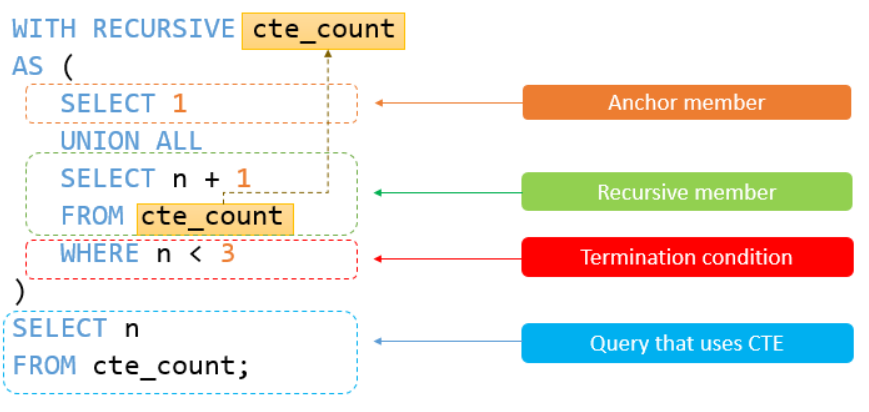
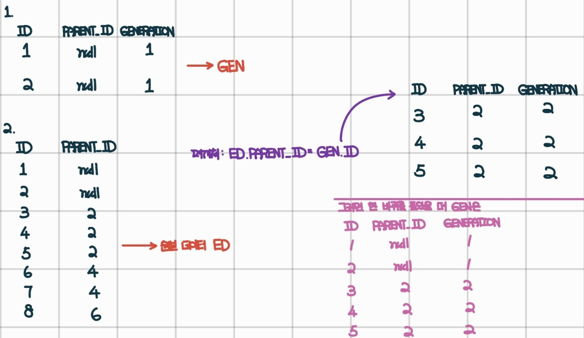

> **1. 오프라인/온라인 판매 데이터 통합하기**  
함수 : SELECT

### 문제 링크

https://school.programmers.co.kr/learn/courses/30/lessons/131537

---

### 문제 설명

다음은 어느 의류 쇼핑몰의 온라인 상품 판매 정보를 담은 `ONLINE_SALE` 테이블과 오프라인 상품 판매 정보를 담은 `OFFLINE_SALE` 테이블 입니다. `ONLINE_SALE` 테이블은 아래와 같은 구조로 되어있으며 `ONLINE_SALE_ID`, `USER_ID`, `PRODUCT_ID`, `SALES_AMOUNT`, `SALES_DATE`는 각각 온라인 상품 판매 ID, 회원 ID, 상품 ID, 판매량, 판매일을 나타냅니다.

|Column name|Type|Nullable|
|-|-|-|
|ONLINE_SALE_ID|INTEGER|FALSE|
|USER_ID|INTEGER|FALSE|
|PRODUCT_ID|INTEGER|FALSE|
|SALES_AMOUNT|INTEGER|FALSE|
|SALES_DATE|DATE|FALSE|

동일한 날짜, 회원 ID, 상품 ID 조합에 대해서는 하나의 판매 데이터만 존재합니다.

`OFFLINE_SALE` 테이블은 아래와 같은 구조로 되어있으며 `OFFLINE_SALE_ID`, `PRODUCT_ID`, `SALES_AMOUNT`, `SALES_DATE`는 각각 오프라인 상품 판매 ID, 상품 ID, 판매량, 판매일을 나타냅니다.

|Column name|Type|Nullable|
|-|-|-|
|OFFLINE_SALE_ID|INTEGER|FALSE|
|PRODUCT_ID|INTEGER|FALSE|
|SALES_AMOUNT|INTEGER|FALSE|
|SALES_DATE|DATE|FALSE|

동일한 날짜, 상품 ID 조합에 대해서는 하나의 판매 데이터만 존재합니다.

---

### 문제

`ONLINE_SALE` 테이블과 `OFFLINE_SALE` 테이블에서 2022년 3월의 오프라인/온라인 상품 판매 데이터의 판매 날짜, 상품ID, 유저ID, 판매량을 출력하는 SQL문을 작성해주세요. `OFFLINE_SALE` 테이블의 판매 데이터의 `USER_ID` 값은 NULL 로 표시해주세요. 결과는 판매일을 기준으로 오름차순 정렬해주시고 판매일이 같다면 상품 ID를 기준으로 오름차순, 상품ID까지 같다면 유저 ID를 기준으로 오름차순 정렬해주세요.


### 풀이

```SQL
SELECT
    DATE_FORMAT(SALES_DATE, '%Y-%m-%d') AS SALES_DATE,
    PRODUCT_ID,
    USER_ID,
    SALES_AMOUNT
FROM ONLINE_SALE
WHERE
    EXTRACT(YEAR_MONTH FROM SALES_DATE) = 202203
UNION
SELECT
    DATE_FORMAT(SALES_DATE, '%Y-%m-%d') AS SALES_DATE,
    PRODUCT_ID,
    NULL AS USER_ID,
    SALES_AMOUNT
FROM OFFLINE_SALE
WHERE
    EXTRACT(YEAR_MONTH FROM SALES_DATE) = 202203
ORDER BY
    SALES_DATE,
    PRODUCT_ID,
    USER_ID
```

### 실행 결과

|SALES_DATE|PRODUCT_ID|USER_ID|SALES_AMOUNT|
|-|-|-|-|
|2022-03-01|3|98|1|
|2022-03-01|27|70|1|
|2022-03-03|1|68|1|
|.|.|.|.|
|.|.|.|.|

---

> **2. 입양 시각  구하기(2)**  
함수 : GROUP BY

### 문제 링크

https://school.programmers.co.kr/learn/courses/30/lessons/59413

---

### 문제 설명

`ANIMAL_OUTS` 테이블은 동물 보호소에서 입양 보낸 동물의 정보를 담은 테이블입니다. `ANIMAL_OUTS` 테이블 구조는 다음과 같으며, `ANIMAL_ID`, `ANIMAL_TYPE`, `DATETIME`, `NAME`, `SEX_UPON_OUTCOME`는 각각 동물의 아이디, 생물 종, 입양일, 이름, 성별 및 중성화 여부를 나타냅니다.

|NAME|Type|Nullable|
|-|-|-|
|ANIMAL_ID|VARCHAR(N)|FALSE|
|ANIMAL_TYPE|VARCHAR(N)|FALSE|
|DATETIME|DATETIME|FALSE|
|NAME|VARCHAR(N)|TRUE|
|SEX_UPON_INTAKE|VARCHAR(N)|FALSE|

---

### 문제

보호소에서는 몇 시에 입양이 가장 활발하게 일어나는지 알아보려 합니다. 0시부터 23시까지, 각 시간대별로 입양이 몇 건이나 발생했는지 조회하는 SQL문을 작성해주세요. 이때 결과는 시간대 순으로 정렬해야 합니다.

### 풀이 1

```SQL
WITH RECURSIVE TIME AS(
SELECT
    0 AS HOUR
UNION
SELECT
    HOUR + 1 FROM TIME
WHERE
    HOUR < 23)
SELECT
    HOUR,
    COUNT(ANIMAL_ID) AS COUNT
FROM TIME
LEFT JOIN ANIMAL_OUTS AS AO
ON TIME.HOUR = HOUR(AO.DATETIME)
GROUP BY
    HOUR
```

### 중요 Point!

```SQL
재귀함수 :

WITH RECURSIVE 사용법:

1. 별칭으로 테이블 저장
2. 최소 한 개의 비반목문(Non-Recursive) 필요
3. 반복문 필요
4. 반복문을 정지시키는 정지조건(Termination condition) 필요

```


### 실행 결과

|HOUR|COUNT|
|-|-|
|0|0|
|1|0|
|2|0|
|.|.|
|.|.|

---

> **3. 특정 세대의 대장균 찾기**  
함수 : SELECT

### 문제 링크

https://school.programmers.co.kr/learn/courses/30/lessons/301650

---

### 문제 설명

대장균들은 일정 주기로 분화하며, 분화를 시작한 개체를 부모 개체, 분화가 되어 나온 개체를 자식 개체라고 합니다.
다음은 실험실에서 배양한 대장균들의 정보를 담은 `ECOLI_DATA` 테이블입니다. `ECOLI_DATA` 테이블의 구조는 다음과 같으며, `ID`, `PARENT_ID`, `SIZE_OF_COLONY`, `DIFFERENTIATION_DATE`, `GENOTYPE` 은 각각 대장균 개체의 ID, 부모 개체의 ID, 개체의 크기, 분화되어 나온 날짜, 개체의 형질을 나타냅니다.

|Column name|Type|Nullable|
|-|-|-|
|ID|INTEGER|FALSE|
|PARENT_ID|INTEGER|TRUE|
|SIZE_OF_COLONY|INTEGER|FALSE|
|DIFFERENTIATION_DATE|DATE|FALSE|
|GENOTYPE|INTEGER|FALSE|

최초의 대장균 개체의 `PARENT_ID` 는 NULL 값입니다.

---

### 문제

3세대의 대장균의 ID(`ID`) 를 출력하는 SQL 문을 작성해주세요. 이때 결과는 대장균의 ID 에 대해 오름차순 정렬해주세요.

### 풀이

```SQL
WITH PARENTS AS (
    SELECT
        ID
    FROM ECOLI_DATA
    WHERE
        PARENT_ID IS NULL)
SELECT
    A.ID
FROM ECOLI_DATA AS A
LEFT JOIN ECOLI_DATA AS B
ON A.PARENT_ID = B.ID
WHERE
    B.PARENT_ID IN (
    SELECT
        ID
    FROM PARENTS)
ORDER BY
    A.ID
```

### 실행 결과

|ID|
|-|
|6|
|7|

---

> **4. 자동차 대여 기록 별 대여 금액 구하기**  
함수 : String, Date

### 문제 링크

https://school.programmers.co.kr/learn/courses/30/lessons/151141

---

### 문제 설명

다음은 어느 자동차 대여 회사에서 대여 중인 자동차들의 정보를 담은 `CAR_RENTAL_COMPANY_CAR` 테이블과 자동차 대여 기록 정보를 담은 `CAR_RENTAL_COMPANY_RENTAL_HISTORY` 테이블과 자동차 종류 별 대여 기간 종류 별 할인 정책 정보를 담은 `CAR_RENTAL_COMPANY_DISCOUNT_PLAN` 테이블 입니다.

`CAR_RENTAL_COMPANY_CAR` 테이블은 아래와 같은 구조로 되어있으며, `CAR_ID`, `CAR_TYPE`, `DAILY_FEE`, `OPTIONS` 는 각각 자동차 ID, 자동차 종류, 일일 대여 요금(원), 자동차 옵션 리스트를 나타냅니다.

|Column name|Type|Nullable|
|-|-|-|
|CAR_ID|INTEGER|FALSE|
|CAR_TYPE|VARCHAR(255)|FALSE|
|DAILY_FEE|INTEGER|FALSE|
|OPTIONS|VARCHAR(255)|FALSE|

자동차 종류는 '세단', 'SUV', '승합차', '트럭', '리무진' 이 있습니다. 자동차 옵션 리스트는 콤마(',')로 구분된 키워드 리스트(옵션 리스트 값 예시: '열선시트', '스마트키', '주차감지센서')로 되어있으며, 키워드 종류는 '주차감지센서', '스마트키', '네비게이션', '통풍시트', '열선시트', '후방카메라', '가죽시트' 가 있습니다.

`CAR_RENTAL_COMPANY_RENTAL_HISTORY` 테이블은 아래와 같은 구조로 되어있으며, `HISTORY_ID`, `CAR_ID`, `START_DATE`, `END_DATE` 는 각각 자동차 대여 기록 ID, 자동차 ID, 대여 시작일, 대여 종료일을 나타냅니다.

|Column name|Type|Nullable|
|-|-|-|
|HISTORY_ID|INTEGER|FALSE|
|CAR_ID|INTEGER|FALSE|
|START_DATE|DATE|FALSE|
|END_DATE|DATE|FALSE|

`CAR_RENTAL_COMPANY_DISCOUNT_PLAN` 테이블은 아래와 같은 구조로 되어있으며, `PLAN_ID`, `CAR_TYPE`, `DURATION_TYPE`, `DISCOUNT_RATE` 는 각각 요금 할인 정책 ID, 자동차 종류, 대여 기간 종류, 할인율(%)을 나타냅니다.

|Column name|Type|Nullable|
|-|-|-|
|PLAN_ID|INTEGER|FALSE|
|DURATION_TYPE|VARCHAR(255)|FALSE|
|CAR_TYPE|VARCHAR(255)|FALSE|
|DISCOUNT_RATE|INTEGER|FALSE|

할인율이 적용되는 대여 기간 종류로는 '7일 이상' (대여 기간이 7일 이상 30일 미만인 경우), '30일 이상' (대여 기간이 30일 이상 90일 미만인 경우), '90일 이상' (대여 기간이 90일 이상인 경우) 이 있습니다. 대여 기간이 7일 미만인 경우 할인정책이 없습니다.

---

### 문제

`CAR_RENTAL_COMPANY_CAR` 테이블과 `CAR_RENTAL_COMPANY_RENTAL_HISTORY` 테이블과 `CAR_RENTAL_COMPANY_DISCOUNT_PLAN` 테이블에서 자동차 종류가 '트럭'인 자동차의 대여 기록에 대해서 대여 기록 별로 대여 금액(컬럼명: `FEE`)을 구하여 대여 기록 ID와 대여 금액 리스트를 출력하는 SQL문을 작성해주세요. 결과는 대여 금액을 기준으로 내림차순 정렬하고, 대여 금액이 같은 경우 대여 기록 ID를 기준으로 내림차순 정렬해주세요.

### 풀이

```SQL
WITH A AS(
    SELECT
        HISTORY_ID,
        ((DATEDIFF(END_DATE, START_DATE)+1) * DAILY_FEE) AS FEE_NODIS,
        (CASE
            WHEN(DATEDIFF(END_DATE, START_DATE)+1) >= 90 THEN '90일 이상'
            WHEN(DATEDIFF(END_DATE, START_DATE)+1) >= 30 THEN '30일 이상'
            WHEN(DATEDIFF(END_DATE, START_DATE)+1) >= 7 THEN '7일 이상'
            ELSE NULL
         END) AS DURATION_TYPE
    FROM CAR_RENTAL_COMPANY_CAR AS C
    JOIN CAR_RENTAL_COMPANY_RENTAL_HISTORY AS RH
    USING(CAR_ID)
    WHERE
        CAR_TYPE = '트럭'
)
SELECT
    HISTORY_ID,
    ROUND(CASE
        WHEN DURATION_TYPE IS NULL THEN FEE_NODIS
        ELSE FEE_NODIS * (1-DISCOUNT_RATE/100)
    END, 0) AS FEE
FROM A
LEFT JOIN (SELECT
        *
      FROM CAR_RENTAL_COMPANY_DISCOUNT_PLAN
      WHERE
        CAR_TYPE = '트럭') AS DP
USING(DURATION_TYPE)
ORDER BY
    FEE DESC,
    HISTORY_ID DESC
```

### 실행 결과

|HISTORY_ID|FEE|
|-|-|
|724|6336960|
|681|5356240|
|630|4791360|
|.|.|
|.|.|

---

> **5. FrontEnd 개발자 찾기**  
함수 : JOIN

### 문제 링크

https://school.programmers.co.kr/learn/courses/30/lessons/276035

---

### 문제 설명

`SKILLCODES` 테이블은 개발자들이 사용하는 프로그래밍 언어에 대한 정보를 담은 테이블입니다. `SKILLCODES` 테이블의 구조는 다음과 같으며, `NAME`, `CATEGORY`, `CODE`는 각각 스킬의 이름, 스킬의 범주, 스킬의 코드를 의미합니다. 스킬의 코드는 2진수로 표현했을 때 각 bit로 구분될 수 있도록 2의 제곱수로 구성되어 있습니다.

|NAME|Type|UNIQUE|Nullable|
|-|-|-|-|
|NAME|VARCHAR(N)|Y|N|
|CATEGORY|VARCHAR(N)|N|N|
|CODE|INTEGER|Y|N|

`DEVELOPERS` 테이블은 개발자들의 프로그래밍 스킬 정보를 담은 테이블입니다. `DEVELOPERS` 테이블의 구조는 다음과 같으며, `ID`, `FIRST_NAME`, `LAST_NAME`, `EMAIL`, `SKILL_CODE`는 각각 개발자의 ID, 이름, 성, 이메일, 스킬 코드를 의미합니다. SKILL_CODE 컬럼은 INTEGER 타입이고, 2진수로 표현했을 때 각 bit는 `SKILLCODES` 테이블의 코드를 의미합니다.

|NAME|Type|UNIQUE|Nullable|
|-|-|-|-|
|ID|VARCHAR(N)|Y|N|
|FIRST_NAME|VARCHAR(N)|N|Y|
|LAST_NAME|VARCHAR(N)|N|Y|
|EMAIL|VARCHAR(N)|Y|N|
|SKILL_CODE|INTEGER|N|N|

예를 들어 어떤 개발자의 `SKILL_CODE`가 400 (=b'110010000')이라면, 이는 `SKILLCODES` 테이블에서 CODE가 256 (=b'100000000'), 128 (=b'10000000'), 16 (=b'10000') 에 해당하는 스킬을 가졌다는 것을 의미합니다.

---

### 문제

`DEVELOPERS` 테이블에서 Front End 스킬을 가진 개발자의 정보를 조회하려 합니다. 조건에 맞는 개발자의 ID, 이메일, 이름, 성을 조회하는 SQL 문을 작성해 주세요.

결과는 ID를 기준으로 오름차순 정렬해 주세요.

### 풀이

```SQL
SELECT
    ID,
    EMAIL,
    FIRST_NAME,
    LAST_NAME
FROM DEVELOPERS
WHERE
    SKILL_CODE & (
    SELECT
        SUM(CODE)
    FROM SKILLCODES
    WHERE
        CATEGORY = 'Front End')
ORDER BY
    ID
```

### 실행 결과

|ID|EMAIL|FIRST_NAME|LAST_NAME|
|-|-|-|-|
|D161|carsen_garza@grepp.co|Carsen|Garza|
|D162|cade_cunningham@grepp.co|Cade|Cunningham|
|D165|jerami_edwards@grepp.co|Jerami|Edwards|


---

> **6. 특정 기간동안 대여 가능한 자동차들의 대여비용 구하기**  
함수 : JOIN

### 문제 링크

https://school.programmers.co.kr/learn/courses/30/lessons/157339

---

### 문제 설명

다음은 어느 자동차 대여 회사에서 대여 중인 자동차들의 정보를 담은 `CAR_RENTAL_COMPANY_CAR` 테이블과 자동차 대여 기록 정보를 담은 `CAR_RENTAL_COMPANY_RENTAL_HISTORY` 테이블과 자동차 종류 별 대여 기간 종류 별 할인 정책 정보를 담은 `CAR_RENTAL_COMPANY_DISCOUNT_PLAN` 테이블 입니다.

`CAR_RENTAL_COMPANY_CAR` 테이블은 아래와 같은 구조로 되어있으며, `CAR_ID`, `CAR_TYPE`, `DAILY_FEE`, `OPTIONS` 는 각각 자동차 ID, 자동차 종류, 일일 대여 요금(원), 자동차 옵션 리스트를 나타냅니다.

|Column name|Type|Nullable|
|-|-|-|
|CAR_ID|INTEGER|FALSE|
|CAR_TYPE|VARCHAR(255)|FALSE|
|DAILY_FEE|INTEGER|FALSE|
|OPTIONS|VARCHAR(255)|FALSE|

자동차 종류는 '세단', 'SUV', '승합차', '트럭', '리무진' 이 있습니다. 자동차 옵션 리스트는 콤마(',')로 구분된 키워드 리스트(옵션 리스트 값 예시: '열선시트', '스마트키', '주차감지센서')로 되어있으며, 키워드 종류는 '주차감지센서', '스마트키', '네비게이션', '통풍시트', '열선시트', '후방카메라', '가죽시트' 가 있습니다.

`CAR_RENTAL_COMPANY_RENTAL_HISTORY` 테이블은 아래와 같은 구조로 되어있으며, `HISTORY_ID`, `CAR_ID`, `START_DATE`, `END_DATE` 는 각각 자동차 대여 기록 ID, 자동차 ID, 대여 시작일, 대여 종료일을 나타냅니다.

|Column name|Type|Nullable|
|-|-|-|
|HISTORY_ID|INTEGER|FALSE|
|CAR_ID|INTEGER|FALSE|
|START_DATE|DATE|FALSE|
|END_DATE|DATE|FALSE|

`CAR_RENTAL_COMPANY_DISCOUNT_PLAN` 테이블은 아래와 같은 구조로 되어있으며, `PLAN_ID`, `CAR_TYPE`, `DURATION_TYPE`, `DISCOUNT_RATE` 는 각각 요금 할인 정책 ID, 자동차 종류, 대여 기간 종류, 할인율(%)을 나타냅니다.

|Column name|Type|Nullable|
|-|-|-|
|PLAN_ID|INTEGER|FALSE|
|DURATION_TYPE|VARCHAR(255)|FALSE|
|CAR_TYPE|VARCHAR(255)|FALSE|
|DISCOUNT_RATE|INTEGER|FALSE|

할인율이 적용되는 대여 기간 종류로는 '7일 이상' (대여 기간이 7일 이상 30일 미만인 경우), '30일 이상' (대여 기간이 30일 이상 90일 미만인 경우), '90일 이상' (대여 기간이 90일 이상인 경우) 이 있습니다. 대여 기간이 7일 미만인 경우 할인정책이 없습니다.

---

### 문제

`CAR_RENTAL_COMPANY_CAR` 테이블과 `CAR_RENTAL_COMPANY_RENTAL_HISTORY` 테이블과 `CAR_RENTAL_COMPANY_DISCOUNT_PLAN` 테이블에서 자동차 종류가 '세단' 또는 'SUV' 인 자동차 중 2022년 11월 1일부터 2022년 11월 30일까지 대여 가능하고 30일간의 대여 금액이 50만원 이상 200만원 미만인 자동차에 대해서 자동차 ID, 자동차 종류, 대여 금액(컬럼명: `FEE`) 리스트를 출력하는 SQL문을 작성해주세요. 결과는 대여 금액을 기준으로 내림차순 정렬하고, 대여 금액이 같은 경우 자동차 종류를 기준으로 오름차순 정렬, 자동차 종류까지 같은 경우 자동차 ID를 기준으로 내림차순 정렬해주세요.

### 풀이

```SQL
WITH RENT_X AS(
SELECT
    CAR_ID
FROM CAR_RENTAL_COMPANY_RENTAL_HISTORY
WHERE
    # 11월 전체 포함
    (START_DATE < '2022-11-01' AND END_DATE > '2022-11-30')
    # START_DATE 혹은 END_DATE가 11월 중 일부를 포함하고 있는 경우
    OR (START_DATE BETWEEN '2022-11-01' AND '2022-11-30')
    OR (END_DATE BETWEEN '2022-11-01' AND '2022-11-30')
    )
SELECT
    CAR_ID,
    CAR_TYPE,
    ROUND(DAILY_FEE*30*(1-DISCOUNT_RATE/100), 0) AS FEE
FROM CAR_RENTAL_COMPANY_CAR AS C
JOIN CAR_RENTAL_COMPANY_DISCOUNT_PLAN AS DP
USING(CAR_TYPE)
WHERE
    CAR_TYPE IN ('세단', 'SUV')
    AND DURATION_TYPE = '30일 이상'
    AND CAR_ID NOT IN(
    SELECT
        *
    FROM RENT_X)
HAVING
    FEE BETWEEN 500000 AND 1999999
ORDER BY
    FEE DESC,
    CAR_TYPE ASC,
    CAR_ID DESC
```

### 실행 결과

|CAR_ID|CAR_TYPE|FEE|
|-|-|-|
|3|세단|1518000|
|23|세단|1380000|

---

> **7. 언어별 개발자 분류하기**  
함수 : GROUP BY

### 문제 링크

https://school.programmers.co.kr/learn/courses/30/lessons/276036

---

### 문제 설명

`SKILLCODES` 테이블은 개발자들이 사용하는 프로그래밍 언어에 대한 정보를 담은 테이블입니다. `SKILLCODES` 테이블의 구조는 다음과 같으며, `NAME`, `CATEGORY`, `CODE`는 각각 스킬의 이름, 스킬의 범주, 스킬의 코드를 의미합니다. 스킬의 코드는 2진수로 표현했을 때 각 bit로 구분될 수 있도록 2의 제곱수로 구성되어 있습니다.

|NAME|Type|UNIQUE|Nullable|
|-|-|-|-|
|NAME|VARCHAR(N)|Y|N|
|CATEGORY|VARCHAR(N)|N|N|
|CODE|INTEGER|Y|N|

`DEVELOPERS` 테이블은 개발자들의 프로그래밍 스킬 정보를 담은 테이블입니다. `DEVELOPERS` 테이블의 구조는 다음과 같으며, `ID`, `FIRST_NAME`, `LAST_NAME`, `EMAIL`, `SKILL_CODE`는 각각 개발자의 ID, 이름, 성, 이메일, 스킬 코드를 의미합니다. SKILL_CODE 컬럼은 INTEGER 타입이고, 2진수로 표현했을 때 각 bit는 `SKILLCODES` 테이블의 코드를 의미합니다.

|NAME|Type|UNIQUE|Nullable|
|-|-|-|-|
|ID|VARCHAR(N)|Y|N|
|FIRST_NAME|VARCHAR(N)|N|Y|
|LAST_NAME|VARCHAR(N)|N|Y|
|EMAIL|VARCHAR(N)|Y|N|
|SKILL_CODE|INTEGER|N|N|

예를 들어 어떤 개발자의 `SKILL_CODE`가 400 (=b'110010000')이라면, 이는 `SKILLCODES` 테이블에서 CODE가 256 (=b'100000000'), 128 (=b'10000000'), 16 (=b'10000') 에 해당하는 스킬을 가졌다는 것을 의미합니다.

---

### 문제

`DEVELOPERS` 테이블에서 GRADE별 개발자의 정보를 조회하려 합니다. GRADE는 다음과 같이 정해집니다.

A : Front End 스킬과 Python 스킬을 함께 가지고 있는 개발자
B : C# 스킬을 가진 개발자
C : 그 외의 Front End 개발자
GRADE가 존재하는 개발자의 GRADE, ID, EMAIL을 조회하는 SQL 문을 작성해 주세요.

결과는 GRADE와 ID를 기준으로 오름차순 정렬해 주세요.

### 풀이

```SQL
SELECT
    (CASE
        WHEN SKILL_CODE & (SELECT
                            SUM(CODE)
                           FROM SKILLCODES
                           WHERE
                            CATEGORY = 'Front End')
        AND SKILL_CODE & (SELECT
                            CODE
                           FROM SKILLCODES
                           WHERE
                            NAME = 'Python') THEN 'A'
        WHEN SKILL_CODE & (SELECT
                            CODE
                           FROM SKILLCODES
                           WHERE
                            NAME = 'C#') THEN 'B'
        WHEN SKILL_CODE & (SELECT
                            SUM(CODE)
                           FROM SKILLCODES
                           WHERE
                            CATEGORY = 'Front End') THEN 'C'
        ELSE NULL
     END) AS GRADE,
     ID,
     EMAIL
FROM DEVELOPERS
HAVING
    GRADE IS NOT NULL
ORDER BY
    GRADE,
    ID
```

### 실행 결과

|GRADE|ID|EMAIL|
|-|-|-|
|A|D162|cade_cunningham@grepp.co|
|A|D165|jerami_edwards@grepp.co|
|B|D164|kelly_grant@grepp.co|
|C|D161|carsen_garza@grepp.co|

---

> **8. 멸종위기의 대장균 찾기**  
함수 :  SELECT

### 문제 링크

https://school.programmers.co.kr/learn/courses/30/lessons/301651

---

### 문제 설명

대장균들은 일정 주기로 분화하며, 분화를 시작한 개체를 부모 개체, 분화가 되어 나온 개체를 자식 개체라고 합니다.
다음은 실험실에서 배양한 대장균들의 정보를 담은 `ECOLI_DATA` 테이블입니다. `ECOLI_DATA` 테이블의 구조는 다음과 같으며, `ID`, `PARENT_ID`, `SIZE_OF_COLONY`, `DIFFERENTIATION_DATE`, `GENOTYPE` 은 각각 대장균 개체의 ID, 부모 개체의 ID, 개체의 크기, 분화되어 나온 날짜, 개체의 형질을 나타냅니다.

|Column name|Type|Nullable|
|-|-|-|
|ID|INTEGER|FALSE|
|PARENT_ID|INTEGER|TRUE|
|SIZE_OF_COLONY|INTEGER|FALSE|
|DIFFERENTIATION_DATE|DATE|FALSE|
|GENOTYPE|INTEGER|FALSE|

최초의 대장균 개체의 `PARENT_ID` 는 NULL 값입니다.

---

### 문제

각 세대별 자식이 없는 개체의 수(`COUNT`)와 세대(`GENERATION`)를 출력하는 SQL문을 작성해주세요. 이때 결과는 세대에 대해 오름차순 정렬해주세요. 단, 모든 세대에는 자식이 없는 개체가 적어도 1개체는 존재합니다.

### 풀이

```SQL
WITH RECURSIVE GEN AS (
SELECT
    ID,
    PARENT_ID,
    1 AS GENERATION
FROM ECOLI_DATA
WHERE PARENT_ID IS NULL
UNION
SELECT
    ED.ID,
    ED.PARENT_ID,
    GEN.GENERATION + 1
FROM ECOLI_DATA AS ED
JOIN GEN
ON ED.PARENT_ID = GEN.ID)

SELECT 
    COUNT(*) AS COUNT,
    GENERATION
FROM GEN
WHERE 
    GEN.ID NOT IN (
        SELECT 
            DISTINCT PARENT_ID 
        FROM ECOLI_DATA 
        WHERE 
            PARENT_ID IS NOT NULL)
GROUP BY 
    GENERATION
ORDER BY 
    GENERATION
```


### 실행 결과

|COUNT|GENERATION|
|-|-|
|1|1|
|1|2|
|2|3|
|1|4|

---

## 추가 문제

> **1. 취소되지 않은 진료 예약 조회하기**  
함수 :  String, Date

### 문제 링크

https://school.programmers.co.kr/learn/courses/30/lessons/132204

---

### 문제 설명

다음은 환자 정보를 담은 `PATIENT` 테이블과 의사 정보를 담은 `DOCTOR` 테이블, 그리고 진료 예약목록을 담은 `APPOINTMENT`에 대한 테이블입니다. `PATIENT` 테이블은 다음과 같으며 `PT_NO`, `PT_NAME`, `GEND_CD`, `AGE`, TLNO는 각각 환자번호, 환자이름, 성별코드, 나이, 전화번호를 의미합니다.

|Column name|Type|Nullable|
|-|-|-|
|PT_NO|VARCHAR(N)|FALSE|
|PT_NAME|VARCHAR(N)|FALSE|
|GEND_CD|VARCHAR(N)|FALSE|
|AGE|INTEGER|FALSE|
|TLNO|VARCHAR(N)|TRUE|

`DOCTOR` 테이블은 다음과 같으며 `DR_NAME`, `DR_ID`, `LCNS_NO`, `HIRE_YMD`, `MCDP_CD`, `TLNO`는 각각 의사이름, 의사ID, 면허번호, 고용일자, 진료과코드, 전화번호를 나타냅니다.

|Column name|Type|Nullable|
|-|-|-|
|DR_NAME|VARCHAR(N)|FALSE|
|DR_ID|VARCHAR(N)|FALSE|
|LCNS_NO|VARCHAR(N)|FALSE|
|HIRE_YMD|DATE|FALSE|
|MCDP_CD|VARCHAR(N)|TRUE|
|TLNO|VARCHAR(N)|TRUE|

`APPOINTMENT` 테이블은 다음과 같으며 `APNT_YMD`, `APNT_NO`, `PT_NO`, `MCDP_CD`, `MDDR_ID`, `APNT_CNCL_YN`, `APNT_CNCL_YMD`는 각각 진료예약일시, 진료예약번호, 환자번호, 진료과코드, 의사ID, 예약취소여부, 예약취소날짜를 나타냅니다.

|Column name|Type|Nullable|
|-|-|-|
|APNT_YMD|TIMESTAMP|FALSE|
|APNT_NO|NUMBER(5)|FALSE|
|PT_NO|VARCHAR(10)|FALSE|
|MCDP_CD|VARCHAR(6)|FALSE|
|MDDR_ID|VARCHAR(10)|FALSE|
|APNT_CNCL_YN|VARCHAR(1)|TRUE|
|APNT_CNCL_YMD|DATE|TRUE|

---

### 문제

`PATIENT`, `DOCTOR` 그리고 `APPOINTMENT` 테이블에서 2022년 4월 13일 취소되지 않은 흉부외과(CS) 진료 예약 내역을 조회하는 SQL문을 작성해주세요. 진료예약번호, 환자이름, 환자번호, 진료과코드, 의사이름, 진료예약일시 항목이 출력되도록 작성해주세요. 결과는 진료예약일시를 기준으로 오름차순 정렬해주세요.

### 풀이

```SQL
SELECT
    A.APNT_NO,
    P.PT_NAME,
    A.PT_NO,
    A.MCDP_CD,
    D.DR_NAME,
    A.APNT_YMD
FROM APPOINTMENT AS A
JOIN DOCTOR AS D
ON A.MDDR_ID = D.DR_ID
JOIN PATIENT AS P
USING(PT_NO)
WHERE
    DATE_FORMAT(APNT_YMD, '%Y-%m-%d') = '2022-04-13'
    AND APNT_CNCL_YN = 'N'
ORDER BY
    APNT_YMD ASC
```

### 실행 결과

|APNT_NO|PT_NAME|PT_NO|MCDP_CD|DR_NAME|APNT_YMD|
|-|-|-|-|-|-|
|43|바라|PT22000019|CS|니모|2022-04-13 15:30:00|

---